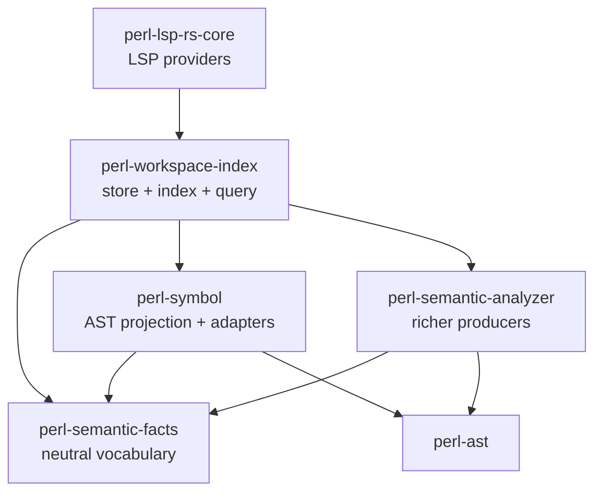
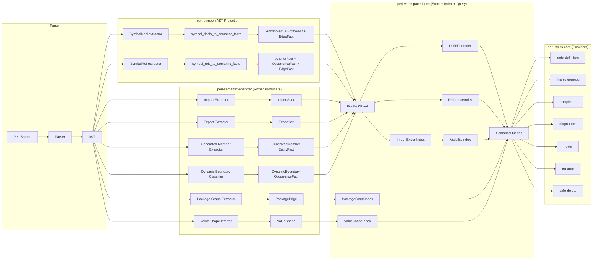
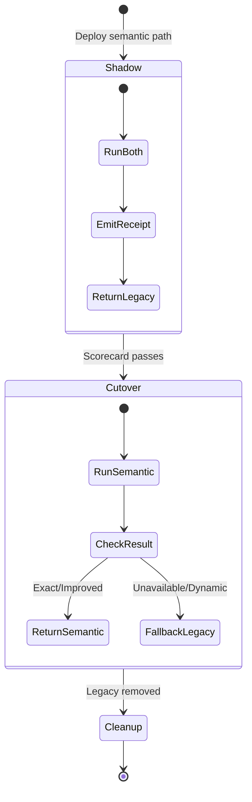
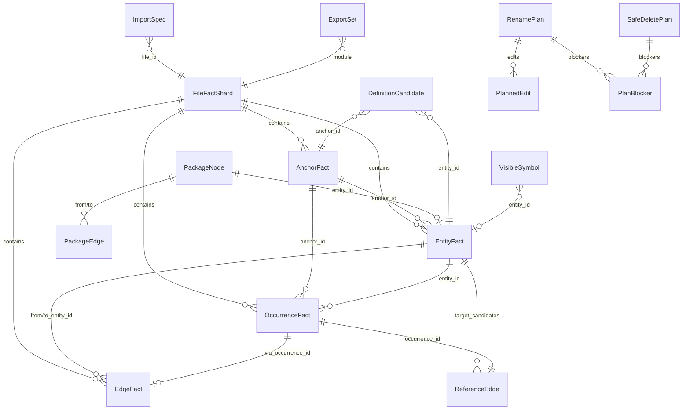
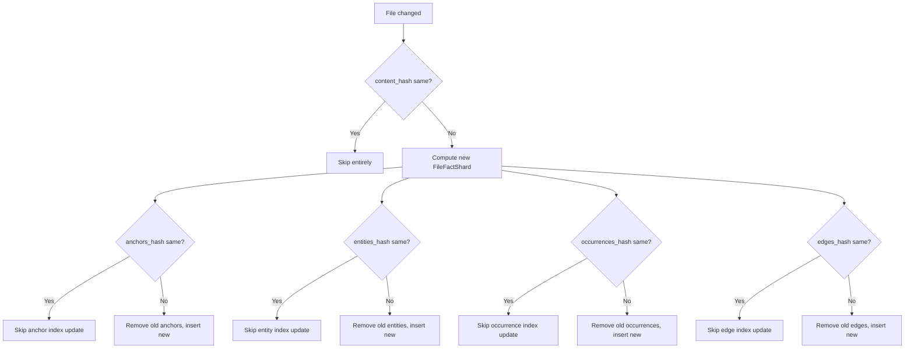

# Design Document: RC2 Semantic Analysis

## Overview

RC2 Semantic Analysis replaces per-provider semantic approximations with a single, layered semantic substrate spanning five existing crates. The design follows a strict layering discipline:

1. **perl-semantic-facts** — neutral vocabulary of IDs, fact records, import/export types, reference edges, and package graph types. No parser, LSP, or workspace dependencies.
2. **perl-symbol** — exact AST projection producing `SymbolDecl`/`SymbolRef` and canonical fact adapters. Depends on `perl-ast` and `perl-semantic-facts`.
3. **perl-semantic-analyzer** — richer producer emitting imports, exports, package graph edges, generated members, dynamic boundaries, and value-shape-lite. Depends on `perl-ast` and `perl-semantic-facts`.
4. **perl-workspace-index** — store + index + query. Owns `FileFactShard`, semantic indexes, `SemanticQueries` facade, incremental invalidation, shadow compare, and scorecards. Depends on `perl-semantic-facts`, `perl-symbol`, `perl-semantic-analyzer`.
5. **perl-lsp-rs-core** — LSP providers that consume the `SemanticQueries` facade. Shadow mode, cutover with fallback, hover explanations.

The implementation follows a linear phased path from stabilizing current substrate seams through provider migration to scorecards proving behavioral improvement.

### Design Rationale

The current architecture has each LSP provider maintaining its own parallel semantic approximation — duplicating scope resolution, symbol lookup, and import inference. This causes:
- Inconsistent results across providers (goto-definition finds a symbol that completion does not offer)
- Duplicated maintenance burden when Perl semantics change
- No single source of truth for cross-cutting concerns like rename safety

The semantic substrate centralizes all semantic knowledge into indexed facts, exposing a single query facade that all providers consume.

## Architecture

### Crate Dependency Graph



### Data Flow



### Layering Constraints

| Crate | MAY depend on | SHALL NOT depend on |
|-------|--------------|-------------------|
| perl-semantic-facts | serde, std | Url, lsp-types, perl-ast, perl-parser-core, any workspace type |
| perl-symbol | perl-ast, perl-semantic-facts | Url, lsp-types, perl-workspace-index |
| perl-semantic-analyzer | perl-ast, perl-semantic-facts | Url, lsp-types, perl-workspace-index |
| perl-workspace-index | perl-semantic-facts, perl-symbol, perl-semantic-analyzer, Url | lsp-types (except in provider bridge code) |
| perl-lsp-rs-core | perl-workspace-index, lsp-types | direct perl-ast access for semantic logic |

## Components and Interfaces

### 1. perl-semantic-facts — New Types

All new types use `#[non_exhaustive]` per project convention.

```rust
// ── Reference Edge (occurrence-based, not entity-to-entity) ──

#[non_exhaustive]
#[derive(Debug, Clone, PartialEq, Eq, Serialize, Deserialize)]
pub struct ReferenceEdge {
    pub occurrence_id: OccurrenceId,
    pub anchor_id: AnchorId,
    pub file_id: FileId,
    pub symbol_key: String,
    pub target_candidates: Vec<EntityId>,
    pub kind: OccurrenceKind,
    pub provenance: Provenance,
    pub confidence: Confidence,
}

// ── Definition Ranking ──

#[non_exhaustive]
#[derive(Debug, Clone, Copy, PartialEq, Eq, PartialOrd, Ord, Hash, Serialize, Deserialize)]
pub enum DefinitionRank {
    ExactQualified,
    SamePackage,
    ExplicitImport,
    DefaultExport,
    WorkspaceCandidate,
    Heuristic,
}

#[non_exhaustive]
#[derive(Debug, Clone, PartialEq, Eq, Serialize, Deserialize)]
pub enum DefinitionRankReason {
    ExactQualifiedName,
    SamePackage,
    ExplicitImport { module: String },
    DefaultExport { module: String },
    WorkspaceSymbol,
    HeuristicNameMatch,
}

#[non_exhaustive]
#[derive(Debug, Clone, PartialEq, Eq, Serialize, Deserialize)]
pub struct DefinitionCandidate {
    pub entity_id: EntityId,
    pub anchor_id: AnchorId,
    pub canonical_name: String,
    pub display_name: String,
    pub package: Option<String>,
    pub kind: EntityKind,
    pub provenance: Provenance,
    pub confidence: Confidence,
    pub rank: DefinitionRank,
    pub rank_reason: DefinitionRankReason,
}

// ── Value Shape ──

#[non_exhaustive]
#[derive(Debug, Clone, PartialEq, Eq, Serialize, Deserialize)]
pub enum ValueShape {
    Unknown,
    Scalar,
    ArrayRef,
    HashRef,
    CodeRef,
    PackageName { package: String },
    Object { package: String, confidence: Confidence },
}

// ── Package Graph ──

#[non_exhaustive]
#[derive(Debug, Clone, PartialEq, Eq, Serialize, Deserialize)]
pub struct PackageNode {
    pub entity_id: EntityId,
    pub name: String,
    pub kind: PackageKind,
    pub anchor_id: Option<AnchorId>,
    pub file_id: Option<FileId>,
}

#[non_exhaustive]
#[derive(Debug, Clone, Copy, PartialEq, Eq, Serialize, Deserialize)]
pub enum PackageKind {
    Package,
    Class,
    Role,
    External,
}

#[non_exhaustive]
#[derive(Debug, Clone, PartialEq, Eq, Serialize, Deserialize)]
pub struct PackageEdge {
    pub from_package: String,
    pub to_package: String,
    pub kind: PackageEdgeKind,
    pub anchor_id: Option<AnchorId>,
    pub provenance: Provenance,
    pub confidence: Confidence,
}

#[non_exhaustive]
#[derive(Debug, Clone, Copy, PartialEq, Eq, Serialize, Deserialize)]
pub enum PackageEdgeKind {
    Inherits,
    ComposesRole,
    DependsOn,
}

// ── Generated Members ──

#[non_exhaustive]
#[derive(Debug, Clone, PartialEq, Eq, Serialize, Deserialize)]
pub struct GeneratedMember {
    pub entity_id: EntityId,
    pub name: String,
    pub kind: GeneratedMemberKind,
    pub source_anchor_id: AnchorId,
    pub package: String,
    pub provenance: Provenance,
    pub confidence: Confidence,
}

#[non_exhaustive]
#[derive(Debug, Clone, Copy, PartialEq, Eq, Serialize, Deserialize)]
pub enum GeneratedMemberKind {
    Getter,
    Setter,
    Accessor,
    Predicate,
    Clearer,
    Builder,
    Constant,
}

// ── Rename and Safe Delete Plans ──

#[non_exhaustive]
#[derive(Debug, Clone, PartialEq, Eq, Serialize, Deserialize)]
pub struct RenamePlan {
    pub entity_id: EntityId,
    pub old_name: String,
    pub new_name: String,
    pub edits: Vec<PlannedEdit>,
    pub blockers: Vec<PlanBlocker>,
    pub warnings: Vec<PlanWarning>,
}

#[non_exhaustive]
#[derive(Debug, Clone, PartialEq, Eq, Serialize, Deserialize)]
pub struct SafeDeletePlan {
    pub entity_id: EntityId,
    pub name: String,
    pub blockers: Vec<PlanBlocker>,
    pub warnings: Vec<PlanWarning>,
}

#[non_exhaustive]
#[derive(Debug, Clone, PartialEq, Eq, Serialize, Deserialize)]
pub struct PlanBlocker {
    pub reason: PlanBlockerReason,
    pub anchor_id: Option<AnchorId>,
    pub description: String,
}

#[non_exhaustive]
#[derive(Debug, Clone, Copy, PartialEq, Eq, Serialize, Deserialize)]
pub enum PlanBlockerReason {
    DynamicBoundary,
    AmbiguousReference,
    CrossModuleExport,
    ImportedSymbol,
    ExportedSymbol,
    ReferencesExist,
    GeneratedMember,
    UnclassifiedOccurrence,
}

#[non_exhaustive]
#[derive(Debug, Clone, PartialEq, Eq, Serialize, Deserialize)]
pub struct PlanWarning {
    pub message: String,
    pub anchor_id: Option<AnchorId>,
}

#[non_exhaustive]
#[derive(Debug, Clone, PartialEq, Eq, Serialize, Deserialize)]
pub struct PlannedEdit {
    pub anchor_id: AnchorId,
    pub file_id: FileId,
    pub category: PlannedEditCategory,
    pub old_text: String,
    pub new_text: String,
}

#[non_exhaustive]
#[derive(Debug, Clone, Copy, PartialEq, Eq, Serialize, Deserialize)]
pub enum PlannedEditCategory {
    Definition,
    Reference,
    ImportList,
    ExportList,
}

// ── Visible Symbol Context ──

#[non_exhaustive]
#[derive(Debug, Clone, PartialEq, Eq, Serialize, Deserialize)]
pub struct VisibleSymbolContext {
    pub source_module: Option<String>,
    pub source_import_anchor_id: Option<AnchorId>,
    pub source_export_anchor_id: Option<AnchorId>,
}
```

#### Modifications to Existing Types

```rust
// ImportSpec gains location fields:
pub struct ImportSpec {
    pub module: String,
    pub kind: ImportKind,
    pub symbols: ImportSymbols,
    pub provenance: Provenance,
    pub confidence: Confidence,
    // NEW fields:
    pub file_id: Option<FileId>,
    pub anchor_id: Option<AnchorId>,
    pub scope_id: Option<ScopeId>,
}

// ExportSet gains module name and anchor:
pub struct ExportSet {
    pub default_exports: Vec<String>,
    pub optional_exports: Vec<String>,
    pub tags: Vec<ExportTag>,
    pub provenance: Provenance,
    pub confidence: Confidence,
    // NEW fields:
    pub module_name: Option<String>,
    pub anchor_id: Option<AnchorId>,
}

// VisibleSymbol gains origin metadata:
pub struct VisibleSymbol {
    pub name: String,
    pub entity_id: Option<EntityId>,
    pub source: VisibleSymbolSource,
    pub confidence: Confidence,
    // NEW fields:
    pub context: Option<VisibleSymbolContext>,
}
```

### 2. perl-symbol — Adapter Cleanup

The `crates/perl-symbol/src/surface/facts.rs` module already contains both `SymbolDeclSemanticFacts` and `SymbolRefSemanticFacts` with the correct field name `reference_edges`. No structural changes needed — the adapter path is already canonical.

The existing adapters:
- `symbol_decls_to_semantic_facts` → `SymbolDeclSemanticFacts` (anchors, entities, defines_edges, unsupported)
- `symbol_refs_to_semantic_facts` → `SymbolRefSemanticFacts` (anchors, occurrences, reference_edges)

### 3. perl-semantic-analyzer — New Producers

#### Import Extractor

New module: `crates/perl-semantic-analyzer/src/analysis/import_extractor.rs`

Walks the AST to extract `ImportSpec` entries from:
- `use Module qw(a b)` → `ImportKind::UseExplicitList`, `ImportSymbols::Explicit(["a", "b"])`
- `use Module ()` → `ImportKind::UseEmpty`, `ImportSymbols::None`
- `use Module ':tag'` → `ImportKind::UseTag`, `ImportSymbols::Tags(["tag"])`
- `use Module` (bare) → `ImportKind::Use`, `ImportSymbols::Default`
- `require Module; Module->import(...)` → `ImportKind::RequireThenImport`
- `use constant { ... }` → `ImportKind::UseConstant`
- `require $var` → `ImportKind::DynamicRequire`, `ImportSymbols::Dynamic`

```rust
pub struct ImportExtractor;

impl ImportExtractor {
    pub fn extract(ast: &Node, file_id: FileId) -> Vec<ImportSpec> { ... }
}
```

#### Package Graph Extractor

New module: `crates/perl-semantic-analyzer/src/analysis/package_graph_extractor.rs`

Extracts `PackageEdge` entries from:
- `use parent 'Base'` / `use base 'Base'` → `PackageEdgeKind::Inherits`
- `@ISA = ('Base')` / `push @ISA, 'Base'` → `PackageEdgeKind::Inherits`
- `extends 'Base'` (Moo/Moose) → `PackageEdgeKind::Inherits`
- `with 'Role'` (Moo/Moose) → `PackageEdgeKind::ComposesRole`

```rust
pub struct PackageGraphExtractor;

impl PackageGraphExtractor {
    pub fn extract(ast: &Node, file_id: FileId) -> Vec<PackageEdge> { ... }
}
```

#### Generated Member Extractor

New module: `crates/perl-semantic-analyzer/src/analysis/generated_member_extractor.rs`

Extracts `GeneratedMember` entries from Moo/Moose `has` declarations. Leverages the existing `class_model::Attribute` extraction.

```rust
pub struct GeneratedMemberExtractor;

impl GeneratedMemberExtractor {
    pub fn extract(ast: &Node, package: &str, file_id: FileId) -> Vec<GeneratedMember> { ... }
}
```

#### Dynamic Boundary Classifier

New module: `crates/perl-semantic-analyzer/src/analysis/dynamic_boundary_classifier.rs`

Classifies dynamic Perl constructs:
- `eval $code` / `eval "..."` → DynamicBoundary occurrence
- `require $var` → DynamicBoundary occurrence
- `*alias = \&target` / `${$name}` → DynamicBoundary occurrence
- `sub AUTOLOAD { ... }` → DynamicBoundary occurrence

```rust
pub struct DynamicBoundaryClassifier;

impl DynamicBoundaryClassifier {
    pub fn classify(ast: &Node, file_id: FileId) -> Vec<OccurrenceFact> { ... }
}
```

#### Value Shape Inferrer

New module: `crates/perl-semantic-analyzer/src/analysis/value_shape_inferrer.rs`

Lightweight type approximation:
- `Foo->new(...)` → `ValueShape::Object { package: "Foo", confidence: High }`
- `bless $ref, 'Pkg'` → `ValueShape::Object { package: "Pkg", confidence: Low }`
- `$self` in method body → `ValueShape::Object { package: <enclosing>, confidence: Medium }`
- Unknown → `ValueShape::Unknown`

```rust
pub struct ValueShapeInferrer;

impl ValueShapeInferrer {
    pub fn infer(ast: &Node, file_id: FileId) -> Vec<(EntityId, ValueShape)> { ... }
}
```

### 4. perl-workspace-index — Semantic Module Tree

```
crates/perl-workspace-index/src/semantic/
  mod.rs              — re-exports and SemanticLayer orchestrator
  facts.rs            — FileFactShard population from canonical producers
  definitions.rs      — DefinitionCandidate index (by qualified name, by bare name)
  references.rs       — ReferenceEdge index (by name, by entity)
  imports.rs          — ImportExportIndex (imports_by_file, exports_by_module)
  visibility.rs       — visible_symbols_at implementation
  package_graph.rs    — PackageGraphIndex with cycle detection
  value_shape.rs      — ValueShapeIndex (entity_id → ValueShape)
  queries.rs          — SemanticQueries trait + WorkspaceSemanticQueries impl
  shadow_compare.rs   — shadow compare infrastructure (extends existing)
  scorecard.rs        — scorecard counts, fixture-backed assertions, reporting
```

#### SemanticQueries Trait

```rust
pub trait SemanticQueries {
    /// Return the entity and occurrence at a given file position.
    fn symbol_at(
        &self,
        file_id: FileId,
        byte_offset: u32,
    ) -> Option<(EntityFact, OccurrenceFact)>;

    /// Return ranked definition candidates for a symbol.
    fn definitions(
        &self,
        symbol: &str,
        context: &QueryContext,
    ) -> Vec<DefinitionCandidate>;

    /// Return typed occurrence references for an entity.
    fn references(
        &self,
        entity_id: EntityId,
    ) -> Vec<OccurrenceFact>;

    /// Return symbols visible at a given file position and scope.
    fn visible_symbols_at(
        &self,
        file_id: FileId,
        byte_offset: u32,
        scope_id: Option<ScopeId>,
    ) -> Vec<VisibleSymbol>;

    /// Return method candidates for a receiver type and method name.
    fn method_candidates(
        &self,
        receiver_shape: &ValueShape,
        method_name: &str,
    ) -> Vec<DefinitionCandidate>;

    /// Return a conservative rename plan.
    fn rename_plan(
        &self,
        entity_id: EntityId,
        new_name: &str,
    ) -> RenamePlan;

    /// Return a conservative safe-delete plan.
    fn safe_delete_plan(
        &self,
        entity_id: EntityId,
    ) -> SafeDeletePlan;
}

/// Context for definition queries (file, scope, imports).
#[non_exhaustive]
pub struct QueryContext {
    pub file_id: FileId,
    pub scope_id: Option<ScopeId>,
    pub byte_offset: Option<u32>,
}
```

#### FileFactShard Population

The existing `build_fact_shard` in `workspace_index.rs` populates from `WorkspaceSymbol` with `SearchFallback` provenance. The new `semantic/facts.rs` module adds a canonical population path:

```rust
pub fn build_canonical_fact_shard(
    uri: &str,
    content_hash: u64,
    decl_facts: &SymbolDeclSemanticFacts,
    ref_facts: &SymbolRefSemanticFacts,
    imports: &[ImportSpec],
    dynamic_boundaries: &[OccurrenceFact],
) -> FileFactShard { ... }
```

This produces `FileFactShard` with real byte spans, `ExactAst` provenance, and per-category hashes computed from the canonical fact vectors.

#### Byte-Span to LSP Range Mapping

```rust
/// Deterministic byte-span to LSP range mapping.
///
/// Uses the existing `perl_parser_core::line_index` to convert byte offsets
/// to line/column, then converts columns to UTF-16 offsets for LSP.
pub fn byte_span_to_lsp_range(
    source: &str,
    span_start_byte: u32,
    span_end_byte: u32,
) -> Option<lsp_types::Range> { ... }
```

### 5. perl-lsp-rs-core — Provider Migration Pattern

Each provider follows a three-phase migration:



#### Fallback Policy Table (Requirement 22)

| Provider | Exact | Ambiguous | Dynamic/Unavailable |
|----------|-------|-----------|-------------------|
| goto-definition | Jump to definition | Show candidate list | Fall back to legacy |
| find-references | Return typed refs | Include grouped candidates | Fall back to legacy |
| completion | Rank symbol high | Rank symbol lower | Show low / omit |
| diagnostics | Warn | Suppress / weak warning | Suppress |
| hover | Explain symbol | Explain ambiguity | Explain dynamic boundary |
| rename | Allow | Block | Block |
| safe-delete | Allow (no refs) | Block | Block |

## Data Models

### Entity Relationship Diagram



### Index Structures

| Index | Key | Value | Location |
|-------|-----|-------|----------|
| definitions_by_qualified | `String` (qualified name) | `Vec<DefinitionCandidate>` | `definitions.rs` |
| definitions_by_bare | `String` (bare name) | `Vec<DefinitionCandidate>` | `definitions.rs` |
| references_by_name | `String` (symbol key) | `Vec<ReferenceEdge>` | `references.rs` |
| references_by_entity | `EntityId` | `Vec<ReferenceEdge>` | `references.rs` |
| imports_by_file | `FileId` | `Vec<ImportSpec>` | `imports.rs` |
| exports_by_module | `String` (module name) | `ExportSet` | `imports.rs` |
| visible_symbols_cache | `(FileId, ScopeId)` | `Vec<VisibleSymbol>` | `visibility.rs` |
| package_graph | `String` (package name) | `PackageNode` + edges | `package_graph.rs` |
| value_shapes | `EntityId` | `ValueShape` | `value_shape.rs` |
| fact_shards | `String` (normalized URI) | `FileFactShard` | `workspace_index.rs` |

### Incremental Invalidation Flow



## Correctness Properties

*A property is a characteristic or behavior that should hold true across all valid executions of a system — essentially, a formal statement about what the system should do. Properties serve as the bridge between human-readable specifications and machine-verifiable correctness guarantees.*

### Property 1: Fact Record JSON Round-Trip

*For any* valid fact record (AnchorFact, EntityFact, OccurrenceFact, EdgeFact, DiagnosticFact, ImportSpec, ExportSet, VisibleSymbol, ReferenceEdge, DefinitionCandidate, ValueShape, PackageEdge, RenamePlan, SafeDeletePlan), serializing to JSON and then deserializing SHALL produce an object equal to the original.

**Validates: Requirements 1.7**

### Property 2: Fact-to-Anchor Referential Integrity

*For any* set of SymbolDecls or SymbolRefs processed through the canonical adapters, every emitted EntityFact SHALL have an `anchor_id` that references an AnchorFact in the same result set, and every emitted OccurrenceFact SHALL have an `anchor_id` that references an AnchorFact in the same result set.

**Validates: Requirements 2.2, 2.3**

### Property 3: Anchor Byte Span Validity

*For any* Perl source file and its extracted facts, every AnchorFact's `span_start_byte` SHALL be less than or equal to `span_end_byte`, and `span_end_byte` SHALL be less than or equal to the source file length in bytes.

**Validates: Requirements 2.4**

### Property 4: Adapter Determinism

*For any* set of SymbolDecls and a FileId, running `symbol_decls_to_semantic_facts` twice with the same inputs SHALL produce identical output (same AnchorIds, EntityIds, EdgeIds, same ordering). The same holds for `symbol_refs_to_semantic_facts`.

**Validates: Requirements 3.2, 3.3, 26.3**

### Property 5: Occurrence Kind Mapping Consistency

*For any* SymbolRef with kind `SubroutineCall`, the adapter SHALL emit an OccurrenceFact with kind `Call`. *For any* SymbolRef with kind `Variable(*)`, the adapter SHALL emit an OccurrenceFact with kind `Read`. The mapping from SymbolRefKind to OccurrenceKind SHALL be a total function.

**Validates: Requirements 4.3**

### Property 6: Entity Resolution Correctness

*For any* SymbolRef and entity map, if the entity map contains a matching entry for the SymbolRef's qualified_name, the emitted OccurrenceFact SHALL have `entity_id = Some(matched_id)`. If the entity map does not contain a matching entry, the emitted OccurrenceFact SHALL have `entity_id = None`.

**Validates: Requirements 4.4, 4.5**

### Property 7: Definition Candidate Sorting Invariant

*For any* result from `SemanticQueries::definitions`, the returned candidate list SHALL be sorted by `DefinitionRank` (ExactQualified < SamePackage < ExplicitImport < DefaultExport < WorkspaceCandidate < Heuristic), and within the same rank, candidates SHALL be sorted deterministically by file URI then source position.

**Validates: Requirements 5.4, 5.5**

### Property 8: Export Set Completeness

*For any* Perl module with Exporter inheritance and `@EXPORT`, `@EXPORT_OK`, or `%EXPORT_TAGS` declarations, the `ExportSet` produced by the export extractor SHALL contain all symbols declared in those arrays, sorted and deduplicated.

**Validates: Requirements 6.5**

### Property 9: Import Visibility Source Attribution

*For any* `use Foo qw(a b)` statement, the visibility index SHALL make symbols `a` and `b` visible with source `ExplicitImport`. *For any* bare `use Foo` statement, the visibility index SHALL make Foo's `@EXPORT` symbols visible with source `DefaultExport`. *For any* `use Foo ':tag'` statement, the visibility index SHALL make all symbols in the named tag visible with source `ExportTag`.

**Validates: Requirements 12.1, 12.3, 12.4**

### Property 10: Dynamic Boundary Fact Invariants

*For any* OccurrenceFact with kind `DynamicBoundary`, the fact SHALL have `provenance = DynamicBoundary` and `confidence = Low`.

**Validates: Requirements 7.2**

### Property 11: Generated Member Provenance Invariant

*For any* EntityFact with kind `GeneratedMember` produced by the generated member extractor, the fact SHALL have `provenance = FrameworkSynthesis` and `confidence = Medium`.

**Validates: Requirements 13.4**

### Property 12: Package Graph Cycle Termination

*For any* package graph containing circular inheritance chains, the `method_candidates` traversal SHALL terminate in finite time and SHALL report the cycle rather than looping indefinitely.

**Validates: Requirements 14.4**

### Property 13: Rename Plan Safety — Dynamic and Export Blockers

*For any* rename plan where the target entity has references crossing a dynamic boundary, the plan SHALL contain a `PlanBlocker` with reason `DynamicBoundary`. *For any* rename plan where the target entity is exported and referenced from other modules, the plan SHALL contain a `PlanBlocker` with reason `CrossModuleExport`.

**Validates: Requirements 16.2, 16.3**

### Property 14: Rename Plan Occurrence Classification

*For any* rename plan, import occurrences SHALL be classified as `PlannedEditCategory::ImportList`, export occurrences SHALL be classified as `PlannedEditCategory::ExportList`, definition occurrences SHALL be classified as `PlannedEditCategory::Definition`, and reference occurrences SHALL be classified as `PlannedEditCategory::Reference`. No occurrence SHALL be left unclassified.

**Validates: Requirements 16.6**

### Property 15: Incremental Invalidation Correctness

*For any* file re-indexing where the whole-file `content_hash` is unchanged, the workspace store SHALL not modify any cross-file indexes. *For any* file re-indexing where a per-category hash is unchanged, the workspace store SHALL skip re-indexing that category. *For any* file re-indexing where a per-category hash has changed, the workspace store SHALL remove old entries and insert new ones for that category.

**Validates: Requirements 18.3, 18.4, 18.5**

### Property 16: Byte-Span to LSP Range Determinism and UTF-8 Correctness

*For any* source file containing multi-byte UTF-8 characters and any valid byte span within that file, the byte-span to LSP range mapping SHALL produce a deterministic result, and the resulting UTF-16 column offsets SHALL correctly account for multi-byte characters (surrogate pairs for characters outside the BMP).

**Validates: Requirements 27.1, 27.3**

### Property 17: Shadow Compare Verdict Determinism

*For any* pair of old-path and new-path query summaries, the `classify_verdict` function SHALL produce the same verdict when called with the same inputs. The verdict SHALL be `Unavailable` when either path is unavailable, `Same` when summaries are equal, `Improved` when the new path has more matches, and `Regression` when the new path has fewer matches.

**Validates: Requirements 10.2, 10.3**

## Error Handling

### Error Categories

| Category | Handling Strategy | Example |
|----------|------------------|---------|
| Parse failure | Skip file, retain stale shard | Syntax error in Perl source |
| Adapter panic | Catch at shard boundary, log, retain stale | Unexpected AST shape |
| Missing entity resolution | Set entity_id = None, confidence = Low | Unresolved symbol reference |
| Circular inheritance | Terminate traversal, report cycle | `A extends B extends A` |
| Dynamic boundary | Emit DynamicBoundary occurrence, suppress diagnostics | `eval $code` |
| UTF-8 encoding error | Return None from byte-span mapping | Invalid byte offset |
| Stale index | content_hash mismatch triggers re-index | File changed on disk |

### Error Propagation Rules

1. **Fact producers** return `Vec<Fact>` (never `Result`). Invalid inputs produce empty vectors or facts with `confidence = Low`.
2. **Index operations** use `Option` for missing entries. No panics on missing data.
3. **Query facade** returns empty collections for missing data, never errors. Callers check emptiness.
4. **Provider fallback** uses the legacy path when the semantic path returns empty or low-confidence results.
5. **Scorecard** records `Unavailable` verdicts for missing semantic results — these are not errors but data points.

### Defensive Patterns

- All `#[non_exhaustive]` types prevent downstream match exhaustiveness assumptions
- `content_hash` comparison prevents stale-shard reprocessing
- Per-category hashes prevent unnecessary index churn
- Cycle detection in package graph prevents infinite loops
- `PlanBlocker` in rename/safe-delete prevents unsafe edits at dynamic boundaries

## Testing Strategy

### Dual Testing Approach

This feature uses both unit tests and property-based tests for comprehensive coverage.

**Unit tests** focus on:
- Specific examples of Perl import/export patterns (Requirement 6 acceptance criteria)
- Dynamic boundary fixture patterns (Requirement 23)
- Generated member extraction for specific Moo/Moose patterns (Requirement 13)
- Provider fallback behavior for each result quality level (Requirement 22)
- Scorecard aggregation and reporting (Requirement 11)

**Property-based tests** focus on:
- Universal invariants that hold across all valid inputs
- Round-trip serialization for all fact types
- Determinism of adapters and ID generation
- Sorting invariants on definition candidates
- Referential integrity between facts and anchors
- Safety invariants on rename/safe-delete plans

### Property-Based Testing Configuration

- **Library**: `proptest` (already available in the Rust ecosystem, compatible with the project's test infrastructure)
- **Minimum iterations**: 100 per property test
- **Tag format**: `// Feature: rc2-semantic-analysis, Property {N}: {title}`

### Property Test Plan

| Property | Crate | Module | Generator Strategy |
|----------|-------|--------|-------------------|
| 1: JSON Round-Trip | perl-semantic-facts | lib.rs | Generate random fact records with arbitrary field values |
| 2: Anchor Referential Integrity | perl-symbol | surface/facts.rs | Generate random SymbolDecl/SymbolRef lists |
| 3: Byte Span Validity | perl-symbol | surface/facts.rs | Generate random spans within source length |
| 4: Adapter Determinism | perl-symbol | surface/facts.rs | Generate random SymbolDecl lists, run twice |
| 5: Occurrence Kind Mapping | perl-symbol | surface/facts.rs | Generate random SymbolRefKind values |
| 6: Entity Resolution | perl-symbol | surface/facts.rs | Generate random SymbolRefs with/without entity maps |
| 7: Definition Sorting | perl-workspace-index | semantic/definitions.rs | Generate random DefinitionCandidate lists |
| 8: Export Completeness | perl-semantic-analyzer | export_analyzer.rs | Generate random export array contents |
| 9: Import Visibility | perl-workspace-index | semantic/visibility.rs | Generate random import statements and export sets |
| 10: Dynamic Boundary Invariants | perl-semantic-analyzer | dynamic_boundary_classifier.rs | Generate dynamic boundary occurrences |
| 11: Generated Member Provenance | perl-semantic-analyzer | generated_member_extractor.rs | Generate has declarations |
| 12: Cycle Termination | perl-workspace-index | semantic/package_graph.rs | Generate random graphs with cycles |
| 13: Rename Safety | perl-workspace-index | semantic/queries.rs | Generate scenarios with dynamic/export refs |
| 14: Rename Classification | perl-workspace-index | semantic/queries.rs | Generate rename scenarios with import/export |
| 15: Incremental Invalidation | perl-workspace-index | semantic/facts.rs | Generate FileFactShards with varying hashes |
| 16: Byte-Span Mapping | perl-workspace-index | semantic/facts.rs | Generate source with multi-byte UTF-8 |
| 17: Shadow Compare Verdict | perl-workspace-index | semantic_shadow_compare.rs | Generate random summary pairs |

### Integration Test Plan

| Test Suite | Scope | Fixtures |
|-----------|-------|----------|
| Import visibility | Visibility index | `use Foo qw(a b)`, `use Foo ()`, `use Foo`, `use Foo ':tag'`, `require Foo; Foo->import(...)` |
| Dynamic boundaries | Diagnostics + rename + safe-delete | `eval $code`, `require $var`, `*alias = \&target`, `sub AUTOLOAD` |
| Provider shadow compare | All providers | Fixture suite per provider with Same/Improved/Regression scenarios |
| Scorecard gates | Per-provider | Fixture suites matching Requirement 10.6–10.10 criteria |
| Generated members | Moo/Moose | `has 'x'`, `has 'x' => (is => 'rw')`, `has 'x' => (is => 'ro')` |
| Package graph | Inheritance + roles | `use parent`, `use base`, `@ISA`, `extends`, `with`, circular chains |

### Implementation Phases

| Phase | Scope | Key PRs |
|-------|-------|---------|
| 0: Stabilize seams | Fix SymbolRef adapter, verify canonical path | 0.1–0.3 |
| 1: Facts through workspace | ReferenceEdge, DefinitionCandidate reason, FileFactShard canonical population | 1.1–1.4 |
| 2: Import extraction | ImportSpec extractor (static use), require/import patterns, ImportExportIndex | 2.1–2.5 |
| 3: Semantic query facade | SemanticQueries trait, definitions, references, visible_symbols_at | 3.1–3.4 |
| 4: Provider migration — navigation | goto-definition shadow + cutover, find-references shadow + cutover | 4.1–4.4 |
| 5: Provider migration — UX | completion cutover, diagnostics cutover | 5.1–5.4 |
| 6: Package graph + generated members | PackageGraphIndex, GeneratedMemberExtractor, method_candidates | 6.1–6.4 |
| 7: Value-shape-lite | ValueShapeInferrer, ValueShapeIndex | 7.1–7.2 |
| 8: Hover | Hover provider using symbol_at + visible_symbols_at context | 8.1–8.2 |
| 9: Rename + safe-delete | rename_plan, safe_delete_plan (conservative) | 9.1–9.4 |
| 10: Invalidation + performance | Per-category hash skip, latency benchmarks, scorecard gates | 10.1–10.3 |
