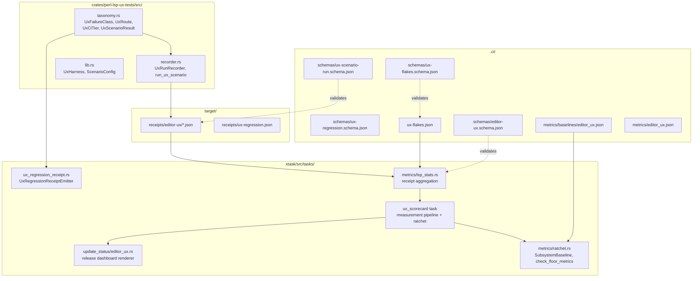

# Design Document: Measured UX Readiness System

## Overview

The Measured UX Readiness System wires perl-lsp's existing UX test harness into a fully automated measurement, classification, trending, and release-gating pipeline. The system answers one question with measured evidence: *when a user opens a real Perl project and performs normal editor actions, does perl-lsp respond correctly, quickly, and stably?*

The design extends existing infrastructure rather than creating parallel systems:

- **Shared enum taxonomy** (`UxFailureClass`, `UxRoute`, `UxCiTier`, `UxScenarioResult`) defined once in `crates/perl-lsp-ux-tests/src/taxonomy.rs`, consumed by both the xtask receipt emitter and the UX test recorder.
- **UxRunRecorder** API added to `crates/perl-lsp-ux-tests/src/recorder.rs` — provides `check()`, `mark_request_start()`, `mark_first_useful_result()`, and panic-safe `run_ux_scenario()`.
- **Receipt-based scorecard aggregation** added to `xtask/src/tasks/metrics/lsp_stats.rs` — reads `target/receipts/editor-ux/*.json` and produces the measured `editor_ux.json`.
- **Flake ledger** at `.ci/ux-flakes.json` with schema at `.ci/schemas/ux-flakes.schema.json`.
- **Release dashboard** rendered by `xtask/src/tasks/update_status/editor_ux.rs` from measured artifacts.

### Data Flow

```
UX scenario execution
  │
  ├─ pass/fail → UxRunRecorder → target/receipts/editor-ux/{workflow_id}-{scenario_stem}-{sha}.json
  │                                        │
  │                                        ▼
  │                              xtask metrics lsp-stats --json [--receipt-dir ...]
  │                                        │
  │                                        ▼
  │                              .ci/metrics/editor_ux.json
  │                                        │
  │                                        ▼
  │                              xtask update-status
  │                                        │
  │                                        ▼
  │                              docs/project/status/quality.md
  │
  └─ failure → ux-regression-receipt → target/receipts/ux-regression.json
                                               │
                                               ▼
                                       CI job summary → route
```

```
Real workspace checkout
  │
  └─ UX scenarios → .ci/metrics/real-workspace/{project}-{platform}.json
                              │
                              ▼
                     editor_ux.json / release dashboard
```

## Architecture

### Module Placement



### Design Decisions

1. **Shared taxonomy in `perl-lsp-ux-tests` crate, not xtask**: The taxonomy module lives in the UX test crate because both the in-process `UxRunRecorder` (test-side) and the xtask receipt emitter (CI-side) need it. Since xtask already depends on `perl-lsp-ux-tests`, this avoids a new crate while keeping a single source of truth.

2. **`serde` added to `perl-lsp-ux-tests` dependencies**: The taxonomy enums and `UxScenarioRunReceipt` struct need `Serialize`/`Deserialize`. The crate already depends on `serde_json`; adding `serde` with `derive` is the minimal change.

3. **`chrono` added to `perl-lsp-ux-tests` dependencies**: The recorder needs ISO-8601 timestamps. This matches the pattern used in xtask.

4. **Operation-scoped timing, not scenario-scoped**: `mark_request_start("completion")` / `mark_first_useful_result("completion")` measures the actual user-perceived wait for a specific LSP operation, not the total scenario wall-clock time.

5. **`catch_unwind` for panic safety**: `run_ux_scenario` wraps the scenario closure in `std::panic::catch_unwind`, writes the receipt to disk, then re-raises the panic. This ensures every execution produces a receipt regardless of termination mode.

6. **Route values are semantic hints, not GitHub labels**: `UxRoute` values like `ci_investigation`, `fixture_update`, `test_fix`, `provider_fix`, `triage` describe *what kind of investigation is needed*, not which GitHub label to apply.

7. **Insufficient data ≠ zero**: Missing receipts produce `insufficient_data` status, never zero pass rate. This prevents the scorecard from misrepresenting untested scenarios as healthy.

8. **Correctness before latency**: Only passing scenarios contribute timing data to p95 computation. Fast-but-wrong results do not inflate latency numbers.

9. **Run artifacts go to `target/`, not `.ci/`**: Generated receipts write to `target/receipts/editor-ux/` by default (overridable via `PERL_LSP_UX_RECEIPT_DIR`). Committed `.ci/` holds schemas, policies, flake ledger, and baselines. This keeps the working tree clean during local test runs. CI uploads `target/receipts/` as an artifact.

10. **Run receipts and failure receipts are joinable**: Run receipts include `workflow_id`, `scenario_file`, and `test_name`; failure receipts include `scenario_file` and `first_failing_test`. The aggregator joins them by per-case identity, not by scenario file alone. Run receipts are authoritative for timing/result/assertions; failure receipts are authoritative for log-derived panic_location, first_failing_line, and route when the scenario panics before in-process classification.

11. **Receipts include `component` field**: Each receipt carries a `component` field (completion, diagnostics, module_resolution, etc.) so aggregation can distinguish failure classes by subsystem. A `provider_regression` in completion is different from one in diagnostics.

12. **Receipts include run identity**: `run_id`, `attempt`, `platform`, `branch`, `sha` enable deduplication and rolling-window computation without ambiguity from reruns.

13. **`insufficient_data` is a metric state, not a scenario result**: `UxScenarioResult` has four values: `pass`, `fail`, `quarantined`, `skipped`. The scorecard uses `MetricState<T>` with `Measured` and `InsufficientData` variants for metric values. This keeps the scenario execution layer clean.

14. **Scorecard aggregation stays in xtask**: The `perl-lsp-ux-tests` crate emits receipts. Scorecard aggregation lives in `xtask/src/tasks/metrics/lsp_stats.rs`. Any legacy direct-measurement helpers in the UX test crate are not the receipt aggregation policy and must not become the new scorecard authority.

15. **Fixture matrix tracks instrumentation level**: Each workflow entry in `editor_ux_fixture_matrix.json` includes an `instrumentation` object with `run_receipt`, `first_useful_result`, and `protocol_goldens` booleans. This makes missing instrumentation visible rather than silently absent.

## Components and Interfaces

### 1. Shared Taxonomy Module

**File:** `crates/perl-lsp-ux-tests/src/taxonomy.rs`

This module defines the four shared enums consumed by both the UX test recorder and the xtask receipt emitter. The existing local `FailureClass` enum in `xtask/src/tasks/ux_regression_receipt.rs` is replaced by a re-export of `UxFailureClass` from this module.

```rust
//! Shared UX readiness enum taxonomy.
//!
//! Defined once, consumed by both the in-process UxRunRecorder
//! and the xtask UxRegressionReceiptEmitter.

use serde::{Deserialize, Serialize};

/// Classification of why a UX scenario failed.
#[derive(Debug, Clone, Copy, PartialEq, Eq, Hash, Serialize, Deserialize)]
#[serde(rename_all = "snake_case")]
#[non_exhaustive]
pub enum UxFailureClass {
    ProviderRegression,
    ServerCrash,
    Timeout,
    TestRace,
    Infra,
    MatrixDrift,
    BaselineDrift,
    NewTestBug,
    Unknown,
}

/// Semantic routing hint for failure investigation.
#[derive(Debug, Clone, Copy, PartialEq, Eq, Hash, Serialize, Deserialize)]
#[serde(rename_all = "snake_case")]
#[non_exhaustive]
pub enum UxRoute {
    CiInvestigation,
    FixtureUpdate,
    TestFix,
    ProviderFix,
    Triage,
    BaselineUpdate,
    CrashFix,
    TimeoutTriage,
}

/// CI execution tier.
#[derive(Debug, Clone, Copy, PartialEq, Eq, Hash, Serialize, Deserialize)]
#[serde(rename_all = "snake_case")]
#[non_exhaustive]
pub enum UxCiTier {
    Pr,
    Nightly,
    Release,
}

/// Outcome of a UX scenario execution.
#[derive(Debug, Clone, Copy, PartialEq, Eq, Hash, Serialize, Deserialize)]
#[serde(rename_all = "snake_case")]
#[non_exhaustive]
pub enum UxScenarioResult {
    Pass,
    Fail,
    Quarantined,
    Skipped,
}

/// State of a metric value in the scorecard.
#[derive(Debug, Clone, Serialize, Deserialize)]
#[serde(rename_all = "snake_case")]
#[non_exhaustive]
pub enum MetricState<T> {
    Measured { value: T, sample_count: usize },
    InsufficientData { reason: String },
}

/// Component subsystem that a scenario exercises.
#[derive(Debug, Clone, Copy, PartialEq, Eq, Hash, Serialize, Deserialize)]
#[serde(rename_all = "snake_case")]
#[non_exhaustive]
pub enum UxComponent {
    Completion,
    Diagnostics,
    ModuleResolution,
    WorkspaceSymbols,
    Rename,
    Hover,
    GotoDefinition,
    Infra,
}

/// Map a failure class to its semantic route.
pub fn route_for_failure_class(class: UxFailureClass) -> UxRoute {
    match class {
        UxFailureClass::ProviderRegression => UxRoute::ProviderFix,
        UxFailureClass::ServerCrash => UxRoute::CrashFix,
        UxFailureClass::Timeout => UxRoute::TimeoutTriage,
        UxFailureClass::Infra => UxRoute::CiInvestigation,
        UxFailureClass::MatrixDrift => UxRoute::FixtureUpdate,
        UxFailureClass::BaselineDrift => UxRoute::BaselineUpdate,
        UxFailureClass::TestRace | UxFailureClass::NewTestBug => UxRoute::TestFix,
        UxFailureClass::Unknown => UxRoute::Triage,
    }
}
```

### 2. UxRunRecorder API

**File:** `crates/perl-lsp-ux-tests/src/recorder.rs`

The recorder is the in-process API that scenario test code uses to record assertions, mark timing, and emit receipts.

```rust
use crate::{UxScenarioSkip};
use crate::taxonomy::{UxCiTier, UxComponent, UxFailureClass, UxRoute, UxScenarioResult,
                       route_for_failure_class};
use serde::{Deserialize, Serialize};
use std::collections::BTreeMap;
use std::path::{Path, PathBuf};
use std::time::Instant;

/// Assertion tracking for a scenario.
#[derive(Debug, Clone, Serialize, Deserialize)]
pub struct AssertionCounts {
    pub passed: Option<u32>,
    pub failed: Option<u32>,
    pub basis: AssertionBasis,
    #[serde(skip_serializing_if = "Vec::is_empty", default)]
    pub failed_check_names: Vec<String>,
}

#[derive(Debug, Clone, Serialize, Deserialize)]
#[serde(rename_all = "snake_case")]
pub enum AssertionBasis {
    Instrumented,
    NotYetInstrumented,
}

/// Per-operation timing entry.
#[derive(Debug, Clone, Serialize, Deserialize)]
pub struct OperationTiming {
    pub operation: String,
    pub time_to_first_useful_result_ms: Option<f64>,
    pub timing_status: Option<String>, // e.g. "missing_request_start"
}

/// CI run identity metadata — fields are optional when unavailable.
#[derive(Debug, Clone, Serialize, Deserialize)]
pub struct RunIdentity {
    pub sha: Option<String>,
    pub branch: Option<String>,
    pub run_id: Option<String>,
    pub attempt: Option<u32>,
    pub platform: Option<String>,
}

/// The machine-readable receipt emitted after each UX scenario execution.
#[derive(Debug, Clone, Serialize, Deserialize)]
pub struct UxScenarioRunReceipt {
    pub kind: String,                          // "ux_scenario_run"
    pub schema_version: u32,                   // 1
    pub measured_at: String,                   // ISO-8601
    pub run_identity: RunIdentity,             // sha, branch, run_id, attempt, platform
    pub workflow_id: String,
    pub scenario_file: String,
    pub test_name: String,                     // per-case identity within scenario file
    pub component: Option<UxComponent>,        // subsystem exercised
    pub ci_tier: UxCiTier,
    pub result: UxScenarioResult,
    pub duration_ms: f64,
    pub time_to_first_useful_result_ms: Option<f64>,
    pub operation_timings: Vec<OperationTiming>,
    pub assertions: AssertionCounts,
    pub failure_class: Option<UxFailureClass>,
    pub route: Option<UxRoute>,
    pub canonical_repro: String,
    pub friendly_repro: String,
}

/// In-process recorder for UX scenario assertions and timing.
pub struct UxRunRecorder {
    workflow_id: String,
    scenario_file: String,
    test_name: String,
    ci_tier: UxCiTier,
    component: Option<UxComponent>,
    start: Instant,
    request_starts: BTreeMap<String, Instant>,
    first_useful_results: BTreeMap<String, f64>,
    passed: u32,
    failed: u32,
    failed_check_names: Vec<String>,
    instrumented: bool,
}

impl UxRunRecorder {
    /// Create a new recorder for a scenario.
    pub fn new(
        workflow_id: impl Into<String>,
        scenario_file: impl Into<String>,
        test_name: impl Into<String>,
        ci_tier: UxCiTier,
        component: Option<UxComponent>,
    ) -> Self { /* ... */ }

    /// Record a named assertion check. Returns Err on failure for `?` chaining.
    pub fn check(&mut self, description: &str, condition: bool) -> Result<(), UxCheckFailure> { /* ... */ }

    /// Mark the start of an LSP request for timing.
    pub fn mark_request_start(&mut self, operation: &str) { /* ... */ }

    /// Mark the first useful result for an operation.
    /// Only the first call per operation is recorded.
    /// If no mark_request_start preceded it, records timing_status = "missing_request_start"
    /// and sets timing to null. No fallback to scenario start time.
    pub fn mark_first_useful_result(&mut self, operation: &str) { /* ... */ }

    /// Finalize as pass and return the receipt.
    pub fn finish_pass(&self) -> UxScenarioRunReceipt { /* ... */ }

    /// Finalize as fail with a failure class and return the receipt.
    pub fn finish_fail(&self, class: UxFailureClass) -> UxScenarioRunReceipt { /* ... */ }

    /// Finalize as skipped with a classified skip reason and return the receipt.
    pub fn finish_skipped(&self, skip: &UxScenarioSkip) -> UxScenarioRunReceipt { /* ... */ }

    /// Write the receipt to the default output directory.
    /// Default: workspace-root target/receipts/editor-ux/.
    /// Override with PERL_LSP_UX_RECEIPT_DIR.
    pub fn write_receipt(&self, receipt: &UxScenarioRunReceipt) -> std::io::Result<PathBuf> {
        let dir = std::env::var("PERL_LSP_UX_RECEIPT_DIR")
            .map(PathBuf::from)
            .unwrap_or_else(|_| PathBuf::from("target/receipts/editor-ux"));
        std::fs::create_dir_all(&dir)?;
        let stem = receipt.scenario_file.trim_end_matches(".rs");
        let sha_short = receipt
            .run_identity
            .sha
            .as_deref()
            .and_then(|s| s.get(..8))
            .unwrap_or("unknown");
        let path = dir.join(format!(
            "{}-{}-{}-{sha_short}.json",
            receipt.workflow_id,
            stem,
            receipt.test_name
        ));
        let json = serde_json::to_string_pretty(receipt)
            .map_err(|e| std::io::Error::new(std::io::ErrorKind::Other, e))?;
        std::fs::write(&path, format!("{json}\n"))?;
        Ok(path)
    }
}

/// Panic-safe scenario wrapper.
///
/// Wraps the scenario closure in `catch_unwind`, ensures a receipt is
/// written to disk on pass, fail, AND panic, then re-raises the panic.
pub fn run_ux_scenario<F>(
    workflow_id: &str,
    scenario_file: &str,
    test_name: &str,
    ci_tier: UxCiTier,
    component: Option<UxComponent>,
    body: F,
) where
    F: FnOnce(&mut UxRunRecorder) -> anyhow::Result<()>,
{
    let mut recorder =
        UxRunRecorder::new(workflow_id, scenario_file, test_name, ci_tier, component);
    let result = std::panic::catch_unwind(std::panic::AssertUnwindSafe(|| body(&mut recorder)));

    match result {
        Ok(Ok(())) => {
            let receipt = recorder.finish_pass();
            let _ = recorder.write_receipt(&receipt);
        }
        Ok(Err(ref err)) => {
            if let Some(skip) = err.downcast_ref::<UxScenarioSkip>() {
                let receipt = recorder.finish_skipped(skip);
                let _ = recorder.write_receipt(&receipt);
                return;
            } else {
                let receipt = recorder.finish_fail(classify_error(err));
                let _ = recorder.write_receipt(&receipt);
                panic!("UX scenario failed: {err}");
            }
        }
        Err(panic_payload) => {
            let receipt = recorder.finish_fail(UxFailureClass::Unknown);
            let _ = recorder.write_receipt(&receipt);
            std::panic::resume_unwind(panic_payload);
        }
    }
}
```

### 3. Updated UxRegressionReceiptEmitter

**File:** `xtask/src/tasks/ux_regression_receipt.rs` (modified)

The existing local `FailureClass` enum is removed. The emitter imports `UxFailureClass` and `UxRoute` from `perl_lsp_ux_tests::taxonomy` and uses `route_for_failure_class()`. The receipt gains dual repro fields:

```rust
// Before (local enum):
// enum FailureClass { MatrixDrift, ... }

// After (shared import):
use perl_lsp_ux_tests::taxonomy::{UxFailureClass, UxRoute, UxComponent,
                                    route_for_failure_class};

#[derive(Debug, Clone, Serialize)]
pub struct UxRegressionReceipt {
    kind: &'static str,
    schema_version: u32,
    measured_at: String,
    sha: String,
    run_id: Option<String>,
    attempt: Option<u32>,
    platform: Option<String>,
    workflow: Option<String>,
    scenario_file: Option<String>,
    scenario: Option<String>,
    test: Option<String>,
    component: Option<UxComponent>,
    result: String,
    failure_class: UxFailureClass,
    panic_location: Option<String>,
    canonical_repro: Option<String>,   // cargo test -p perl-lsp-ux-tests ...
    friendly_repro: Option<String>,    // just ux-tests ...
    first_failing_line: Option<String>,
    route: UxRoute,
}
```

The `infer_failure_class()` function returns `UxFailureClass` instead of the local enum. The `route_for_class()` function is replaced by `route_for_failure_class()` from the taxonomy module.

### 4. Receipt-Based Scorecard Aggregator

**File:** `xtask/src/tasks/metrics/lsp_stats.rs` (extended)

A new `aggregate_from_receipts()` function reads all `UxScenarioRunReceipt` files from `target/receipts/editor-ux/` (or `--receipt-dir` override), computes:

- **workflow_pass_rate**: `count(result == pass) / count(result ∈ {pass, fail})` — excludes quarantined and skipped receipts. `insufficient_data` is represented by `MetricState`, not by `UxScenarioResult`.
- **workflow_stability_rate**: pass consistency over last N receipts per workflow, quarantined counts as unstable.
- **p95_time_to_first_useful_result_ms**: 95th percentile of `time_to_first_useful_result_ms` from passing scenarios only.
- **Per-workflow rows**: workflow_id, scenario_file, test_name, subsystem_owner, pass_rate, stability_rate, p95 timing.
- **Component metrics**: cross_file_definition_success_rate, module_resolution_workflow_success_rate, multi_root_workspace_navigation_success_rate.

```rust
/// Phase 2: Aggregate from per-scenario run receipts.
pub fn aggregate_from_receipts(
    receipts_dir: &Path,
    fixture_matrix: &Path,
    flake_ledger: Option<&Path>,
) -> Result<MeasuredEditorUxScorecard> { /* ... */ }

/// The measured scorecard conforming to .ci/schemas/editor-ux.schema.json.
#[derive(Debug, Serialize, Deserialize)]
pub struct MeasuredEditorUxScorecard {
    pub schema_version: u32,
    pub measured_at: String,
    pub subsystem: String,
    pub top_line: TopLineMetrics,
    pub components: ComponentMetrics,
    pub workflows: Vec<WorkflowResult>,
    pub provenance: Provenance,
}
```

### 5. Flake Ledger

**File:** `.ci/ux-flakes.json`
**Schema:** `.ci/schemas/ux-flakes.schema.json`

```json
{
  "schema_version": 1,
  "entries": [
    {
      "test": "ux_scenario_06_large_file::large_file_open",
      "crate": "perl-lsp-ux-tests",
      "subsystem": "engineering_health",
      "state": "active",
      "failure_mode": "Timing-sensitive: large file indexing occasionally exceeds timeout on loaded CI runners",
      "failure_class": "timeout",
      "issue": 7100,
      "owner": "@maintainer",
      "first_seen": "2026-05-01",
      "resolved_in": null,
      "resolved_at": null,
      "notes": null
    }
  ],
  "summary": {
    "total": 1,
    "active": 1,
    "resolved": 0,
    "by_subsystem": {
      "engineering_health": 1
    }
  }
}
```

The schema enforces `owner`, `issue`, and `failure_class` as required for `active` entries.

### 6. Release Dashboard Renderer

**File:** `xtask/src/tasks/update_status/editor_ux.rs` (extended)

The existing `generate_editor_ux_receipt()` is extended to consume the measured `editor_ux.json` scorecard and render:

- Top-line metrics (pass rate, stability rate, p95 latency)
- Active quarantine table with owner, issue, failure_class, age, stale flag (>14 days)
- Real-workspace baseline status per project
- AI completion validation status
- Editor client matrix (validated / manual / docs-only)
- Release threshold go/no-go summary

### 7. Real-Workspace Harness

Extends the existing UX harness to clone real open-source Perl projects (Mojolicious, DBIx::Class, Catalyst) and run UX scenarios against them. Emits standard `UxScenarioRunReceipt` files that the scorecard aggregator ingests alongside synthetic scenario receipts.

Receipts are written to `.ci/metrics/real-workspace/{project}-{platform}.json`.

### 8. Run Receipt JSON Schema

**File:** `.ci/schemas/ux-scenario-run.schema.json`

```json
{
  "$schema": "https://json-schema.org/draft/2020-12/schema",
  "title": "UX scenario run receipt",
  "type": "object",
  "required": [
    "kind", "schema_version", "measured_at", "run_identity",
    "workflow_id", "scenario_file", "test_name", "ci_tier", "result",
    "duration_ms", "assertions", "canonical_repro", "friendly_repro"
  ],
  "properties": {
    "kind": { "const": "ux_scenario_run" },
    "schema_version": { "const": 1 },
    "measured_at": { "type": "string", "format": "date-time" },
    "run_identity": {
      "type": "object",
      "properties": {
        "sha": { "type": "string", "minLength": 1 },
        "branch": { "type": "string", "minLength": 1 },
        "run_id": { "type": "string", "minLength": 1 },
        "attempt": { "type": "integer", "minimum": 1 },
        "platform": { "type": "string", "minLength": 1 }
      },
      "additionalProperties": false
    },
    "workflow_id": { "type": "string", "minLength": 1 },
    "scenario_file": { "type": "string", "minLength": 1 },
    "test_name": { "type": "string", "minLength": 1 },
    "component": {
      "oneOf": [
        { "enum": [
          "completion", "diagnostics", "module_resolution", "workspace_symbols",
          "rename", "hover", "goto_definition", "infra"
        ]},
        { "type": "null" }
      ]
    },
    "ci_tier": { "enum": ["pr", "nightly", "release"] },
    "result": { "enum": ["pass", "fail", "quarantined", "skipped"] },
    "duration_ms": { "type": "number", "minimum": 0 },
    "time_to_first_useful_result_ms": { "type": ["number", "null"], "minimum": 0 },
    "operation_timings": {
      "type": "array",
      "items": {
        "type": "object",
        "required": ["operation"],
        "properties": {
          "operation": { "type": "string" },
          "time_to_first_useful_result_ms": { "type": ["number", "null"] },
          "timing_status": { "type": ["string", "null"] }
        }
      }
    },
    "assertions": {
      "type": "object",
      "required": ["passed", "failed", "basis"],
      "properties": {
        "passed": { "type": ["integer", "null"], "minimum": 0 },
        "failed": { "type": ["integer", "null"], "minimum": 0 },
        "basis": { "enum": ["instrumented", "not_yet_instrumented"] },
        "failed_check_names": { "type": "array", "items": { "type": "string" } }
      }
    },
    "failure_class": {
      "oneOf": [
        { "enum": [
          "provider_regression", "server_crash", "timeout", "test_race",
          "infra", "matrix_drift", "baseline_drift", "new_test_bug", "unknown"
        ]},
        { "type": "null" }
      ]
    },
    "route": {
      "oneOf": [
        { "enum": [
          "ci_investigation", "fixture_update", "test_fix", "provider_fix",
          "triage", "baseline_update", "crash_fix", "timeout_triage"
        ]},
        { "type": "null" }
      ]
    },
    "canonical_repro": { "type": "string" },
    "friendly_repro": { "type": "string" }
  },
  "additionalProperties": false
}
```

## Data Models

### Enum Taxonomy (Rust → JSON mapping)

| Rust Enum | Rust Variant | JSON Value |
|-----------|-------------|------------|
| `UxFailureClass` | `ProviderRegression` | `"provider_regression"` |
| `UxFailureClass` | `ServerCrash` | `"server_crash"` |
| `UxFailureClass` | `Timeout` | `"timeout"` |
| `UxFailureClass` | `TestRace` | `"test_race"` |
| `UxFailureClass` | `Infra` | `"infra"` |
| `UxFailureClass` | `MatrixDrift` | `"matrix_drift"` |
| `UxFailureClass` | `BaselineDrift` | `"baseline_drift"` |
| `UxFailureClass` | `NewTestBug` | `"new_test_bug"` |
| `UxFailureClass` | `Unknown` | `"unknown"` |
| `UxRoute` | `CiInvestigation` | `"ci_investigation"` |
| `UxRoute` | `FixtureUpdate` | `"fixture_update"` |
| `UxRoute` | `TestFix` | `"test_fix"` |
| `UxRoute` | `ProviderFix` | `"provider_fix"` |
| `UxRoute` | `Triage` | `"triage"` |
| `UxRoute` | `BaselineUpdate` | `"baseline_update"` |
| `UxRoute` | `CrashFix` | `"crash_fix"` |
| `UxRoute` | `TimeoutTriage` | `"timeout_triage"` |
| `UxCiTier` | `Pr` | `"pr"` |
| `UxCiTier` | `Nightly` | `"nightly"` |
| `UxCiTier` | `Release` | `"release"` |
| `UxScenarioResult` | `Pass` | `"pass"` |
| `UxScenarioResult` | `Fail` | `"fail"` |
| `UxScenarioResult` | `Quarantined` | `"quarantined"` |
| `UxScenarioResult` | `Skipped` | `"skipped"` |
| `UxComponent` | `Completion` | `"completion"` |
| `UxComponent` | `Diagnostics` | `"diagnostics"` |
| `UxComponent` | `ModuleResolution` | `"module_resolution"` |
| `UxComponent` | `WorkspaceSymbols` | `"workspace_symbols"` |
| `UxComponent` | `Rename` | `"rename"` |
| `UxComponent` | `Hover` | `"hover"` |
| `UxComponent` | `GotoDefinition` | `"goto_definition"` |
| `UxComponent` | `Infra` | `"infra"` |

### Failure Class → Route Mapping

| UxFailureClass | UxRoute |
|---------------|---------|
| `provider_regression` | `provider_fix` |
| `server_crash` | `crash_fix` |
| `timeout` | `timeout_triage` |
| `infra` | `ci_investigation` |
| `matrix_drift` | `fixture_update` |
| `baseline_drift` | `baseline_update` |
| `test_race` | `test_fix` |
| `new_test_bug` | `test_fix` |
| `unknown` | `triage` |

### Scorecard Aggregation Model

The measured `editor_ux.json` conforms to `.ci/schemas/editor-ux.schema.json`:

```
editor_ux.json
├── schema_version: 1
├── measured_at: ISO-8601
├── subsystem: "editor_ux"
├── top_line
│   ├── workflow_pass_rate: { value, kind, basis, coverage, confidence }
│   ├── workflow_stability_rate: { value, kind, basis, coverage, confidence }
│   └── p95_time_to_first_useful_result_ms: { value, kind, basis, coverage, confidence }
├── components
│   ├── cross_file_definition_success_rate
│   ├── module_resolution_workflow_success_rate
│   └── multi_root_workspace_navigation_success_rate
├── workflows[]
│   ├── id, scenario, subsystem_owner
│   ├── pass_rate, stability_rate, p95_time_to_first_useful_result_ms
│   └── component_metrics (optional per-workflow drill-down)
└── provenance
    ├── fixture_matrix: path
    ├── harness: "crates/perl-lsp-ux-tests"
    ├── tiers: ["pr", "nightly", "release"]
    └── notes: []
```

### Flake Ledger Model

```
.ci/ux-flakes.json
├── schema_version: 1
├── entries[]
│   ├── test: "module::function"
│   ├── crate: "perl-lsp-ux-tests"
│   ├── subsystem: string
│   ├── state: "active" | "resolved"
│   ├── failure_mode: string
│   ├── failure_class: UxFailureClass value
│   ├── issue: integer (GitHub issue number)
│   ├── owner: string (GitHub handle)
│   ├── first_seen: ISO-8601 date
│   ├── resolved_in: integer | null (PR number)
│   ├── resolved_at: ISO-8601 date | null
│   └── notes: string | null
└── summary
    ├── total, active, resolved
    └── by_subsystem: { subsystem: count }
```

### Ratchet Baseline Model

The existing `.ci/metrics/baselines/editor_ux.json` already defines floor metrics for correctness percentages and latency percentiles. The ratchet checker in `xtask/src/tasks/metrics/ratchet.rs` is reused without modification — the scorecard aggregator produces a `BTreeMap<String, Option<f64>>` of current metrics that feeds directly into `check_floor_metrics()`.

### Dependency Changes

| Crate | Added Dependency | Reason |
|-------|-----------------|--------|
| `perl-lsp-ux-tests` | `serde = { workspace = true }` | `Serialize`/`Deserialize` for taxonomy enums and receipt structs |
| `perl-lsp-ux-tests` | `chrono = "0.4"` | ISO-8601 timestamps in receipts |

No new crates are introduced. No new workspace members are added.

## Correctness Properties

*A property is a characteristic or behavior that should hold true across all valid executions of a system — essentially, a formal statement about what the system should do. Properties serve as the bridge between human-readable specifications and machine-verifiable correctness guarantees.*

### Property 1: Classification totality

*For any* string input to the failure classification function, the output SHALL be exactly one valid `UxFailureClass` variant — the function is total and never panics or returns an out-of-enum value.

**Validates: Requirements 0.1, 0.3, 1.2**

### Property 2: Dual repro completeness

*For any* test name string, a failure receipt produced by the `UxRegressionReceiptEmitter` SHALL contain both a non-empty `canonical_repro` field (containing the `cargo test` command with the test name) and a non-empty `friendly_repro` field (containing the `just ux-tests` shorthand).

**Validates: Requirements 0.4, 1.9**

### Property 3: Route mapping correctness

*For any* `UxFailureClass` variant, `route_for_failure_class` SHALL return the `UxRoute` specified by the mapping table: `provider_regression → provider_fix`, `server_crash → crash_fix`, `timeout → timeout_triage`, `infra → ci_investigation`, `matrix_drift → fixture_update`, `baseline_drift → baseline_update`, `test_race|new_test_bug → test_fix`, `unknown → triage`.

**Validates: Requirements 1.3, 1.4, 1.5, 1.6, 1.7, 1.8**

### Property 4: Run receipt completeness and failure-class invariant

*For any* scenario execution (pass, fail, panic, or skip) with a valid workflow_id, scenario_file, test_name, and ci_tier, the `UxRunRecorder` SHALL produce a `UxScenarioRunReceipt` where: (a) all required fields are present and valid, (b) `failure_class` and `route` are non-null when `result` is `fail`, `quarantined`, or `skipped`, (c) `failure_class` and `route` are null when `result` is `pass`, and (d) `skip_reason` is present when `result` is `skipped`.

**Validates: Requirements 2.1, 2.2, 2.6, 2.7**

### Property 5: Assertion counting invariant

*For any* sequence of `recorder.check(description, condition)` calls, the receipt's `assertions.passed` SHALL equal the count of calls where `condition` was `true`, and `assertions.failed` SHALL equal the count where `condition` was `false`, and `assertions.basis` SHALL be `instrumented`.

**Validates: Requirements 2.5, 13.2**

### Property 6: Panic-safe receipt emission

*For any* scenario body passed to `run_ux_scenario` — whether it completes normally, fails an assertion, or panics — a `UxScenarioRunReceipt` file SHALL exist on disk after the wrapper returns or re-raises the panic.

**Validates: Requirements 2b.1, 2b.2, 2b.3, 2b.4, 2b.5**

### Property 7: Operation timing correctness

*For any* operation where `mark_request_start(op)` is called followed by `mark_first_useful_result(op)`, the recorded `time_to_first_useful_result_ms` for that operation SHALL be non-negative. *For any* operation where `mark_first_useful_result` is never called, the timing SHALL be null. *For any* scenario with N timed operations, the `operation_timings` array SHALL contain exactly N entries.

**Validates: Requirements 3.2, 3.7, 3b.3, 3b.5**

### Property 8: First-useful-result idempotence

*For any* operation, calling `mark_first_useful_result(operation)` more than once SHALL retain only the timestamp from the first call — subsequent calls SHALL not alter the recorded value.

**Validates: Requirements 13.5**

### Property 9: Pass rate computation correctness

*For any* set of `UxScenarioRunReceipt` records, the computed `workflow_pass_rate` SHALL equal `count(result == pass) / count(result ∈ {pass, fail})`, excluding receipts with result `quarantined` or `skipped` from both numerator and denominator. Missing or incomplete data is represented separately as `MetricState::InsufficientData`, not as a scenario result. Workflows with zero eligible receipts SHALL be excluded from the top-line computation.

**Validates: Requirements 4.2, 4b.4**

### Property 10: Stability rate computation correctness

*For any* workflow with a sequence of receipts, the computed `workflow_stability_rate` SHALL reflect pass consistency over the receipt window, counting `quarantined` results as unstable. Workflows with fewer receipts than the minimum stability threshold SHALL have `stability_rate` reported as null.

**Validates: Requirements 4.3, 4b.2, 6.4**

### Property 11: Latency p95 correctness-gated

*For any* set of `UxScenarioRunReceipt` records, the computed `p95_time_to_first_useful_result_ms` SHALL be the 95th percentile of `time_to_first_useful_result_ms` values from receipts where `result == pass` and the timing value is non-null. Receipts with `result ∈ {fail, quarantined, skipped}` SHALL be excluded from the latency computation.

**Validates: Requirements 4.4, 5b.1, 5b.2**

### Property 12: Insufficient data handling

*For any* workflow declared in the fixture matrix that has zero `UxScenarioRunReceipt` files in the receipts directory, the scorecard SHALL report that workflow's metric values as `MetricState::InsufficientData` (not zero, not pass). *For any* workflow with receipts containing `result == skipped`, the scorecard SHALL report `skipped` (distinct from `insufficient_data`).

**Validates: Requirements 4b.1, 4b.3**

### Property 13: Flake ledger summary consistency

*For any* set of entries in the flake ledger, the `summary.total` SHALL equal the number of entries, `summary.active` SHALL equal the count of entries with `state == "active"`, `summary.resolved` SHALL equal the count with `state == "resolved"`, and each `by_subsystem` count SHALL equal the count of entries with that subsystem value.

**Validates: Requirements 6.7**

### Property 14: Stale quarantine detection

*For any* flake ledger entry with `state == "active"` and `first_seen` date more than 14 days before the current date, the release dashboard renderer SHALL flag that entry as stale.

**Validates: Requirements 6b.3**

## Error Handling

### Receipt Emission Errors

- **Disk write failure during receipt emission**: `UxRunRecorder.write_receipt()` returns `std::io::Result`. The `run_ux_scenario` wrapper uses `let _ = recorder.write_receipt(...)` to avoid masking the original panic. If the receipt cannot be written, the scenario result (pass/fail/panic) is still propagated to the test runner. A missing receipt will surface as `insufficient_data` in the scorecard aggregator.

- **Directory creation failure**: `write_receipt()` calls `create_dir_all` before writing. If the directory cannot be created (permissions, disk full), the error propagates as `io::Error`.

### Classification Errors

- **Unrecognizable log content**: The `infer_failure_class()` function always returns a valid `UxFailureClass` — unrecognizable content maps to `Unknown` with route `Triage`. The function never panics.

- **Malformed log input**: Empty strings, binary content, or truncated logs all classify as `Unknown`. The classifier operates on string content only and does not parse structured data.

### Aggregation Errors

- **Missing receipt directory**: If `target/receipts/editor-ux/` does not exist, the aggregator treats all workflows as `insufficient_data`.

- **Malformed receipt JSON**: Individual receipt files that fail to parse are logged as warnings and excluded from aggregation. The aggregator does not fail on a single bad receipt.

- **Schema version mismatch**: Receipts with `schema_version != 1` are skipped with a warning.

- **Missing fixture matrix**: If the fixture matrix file is missing, the aggregator cannot determine declared workflows and falls back to receipt-only aggregation (no `insufficient_data` detection for undeclared workflows).

### Timing Errors

- **mark_first_useful_result without mark_request_start**: Records `timing_status: "missing_request_start"` and sets timing to null. Does not fall back to scenario construction time — that would create a fake latency sample. The null timing is excluded from p95 computation.

- **Negative timing values**: Not possible — `Instant::elapsed()` is monotonic. The recorder uses `std::time::Instant` which guarantees non-negative durations.

### Ratchet Errors

- **Missing baseline file**: `load_baseline()` returns `Err` with a descriptive message. The ratchet check fails loudly rather than silently passing.

- **Null baseline metrics**: Skipped silently — a null baseline value means "not yet instrumented" and cannot regress.

- **Null current metrics**: Skipped silently — a missing current measurement does not trigger a violation.

### Flake Ledger Errors

- **Missing ledger file**: The aggregator treats all scenarios as non-quarantined. No quarantine exemptions are applied.

- **Malformed ledger entries**: The ledger is validated against `.ci/schemas/ux-flakes.schema.json`. Invalid entries are rejected at commit time via CI schema validation.

## Testing Strategy

### Property-Based Testing

This feature is well-suited for property-based testing because the core logic consists of pure functions with clear input/output behavior:

- **Classification function**: string → UxFailureClass (pure, large input space)
- **Route mapping**: UxFailureClass → UxRoute (pure, finite input space)
- **Assertion counting**: sequence of (string, bool) → (u32, u32) (pure, large input space)
- **Pass rate computation**: Vec<UxScenarioRunReceipt> → f64 (pure, large input space)
- **Stability rate computation**: Vec<UxScenarioRunReceipt> → Option<f64> (pure)
- **p95 latency computation**: Vec<UxScenarioRunReceipt> → Option<f64> (pure)
- **Flake ledger summary**: Vec<FlakeEntry> → Summary (pure)

**Library**: `proptest` (already in workspace dependencies as version 1.11.0)

**Configuration**: Minimum 100 iterations per property test.

**Tag format**: Each property test is tagged with a comment:
```rust
// Feature: ux-readiness-system, Property N: <property_text>
```

### Dual Testing Approach

**Property-based tests** (14 properties above):
- Verify universal invariants across randomly generated inputs
- Cover the classification, routing, counting, aggregation, and timing logic
- Each property maps to one `proptest!` test with ≥100 iterations

**Unit tests** (example-based):
- Specific classification examples (timeout log → Timeout, assertion failure → ProviderRegression)
- Known receipt aggregation scenarios with expected output values
- Schema validation of example receipts against JSON schemas
- Edge cases: empty receipt directory, single receipt, all-quarantined receipts
- Existing tests in `ux_regression_receipt.rs` and `ratchet.rs` are preserved and extended

**Integration tests**:
- End-to-end `run_ux_scenario` with a real scenario body that passes, fails, and panics
- `cargo xtask metrics lsp-stats --json` with test receipt files
- `cargo xtask ux-scorecard --ratchet-check` with test baselines
- Real-workspace harness smoke test (nightly tier only)

### Test File Placement

| Test | Location |
|------|----------|
| Taxonomy enum serialization round-trip | `crates/perl-lsp-ux-tests/src/taxonomy.rs` (inline `#[cfg(test)]`) |
| Route mapping property | `crates/perl-lsp-ux-tests/src/taxonomy.rs` (inline `#[cfg(test)]`) |
| UxRunRecorder assertion counting | `crates/perl-lsp-ux-tests/src/recorder.rs` (inline `#[cfg(test)]`) |
| UxRunRecorder timing properties | `crates/perl-lsp-ux-tests/src/recorder.rs` (inline `#[cfg(test)]`) |
| run_ux_scenario panic safety | `crates/perl-lsp-ux-tests/src/recorder.rs` (inline `#[cfg(test)]`) |
| Classification totality property | `xtask/src/tasks/ux_regression_receipt.rs` (inline `#[cfg(test)]`) |
| Dual repro completeness | `xtask/src/tasks/ux_regression_receipt.rs` (inline `#[cfg(test)]`) |
| Scorecard aggregation properties | `xtask/src/tasks/metrics/lsp_stats.rs` (inline `#[cfg(test)]`) |
| Flake ledger summary consistency | `xtask/src/tasks/metrics/lsp_stats.rs` (inline `#[cfg(test)]`) |
| Stale quarantine detection | `xtask/src/tasks/update_status/editor_ux.rs` (inline `#[cfg(test)]`) |
