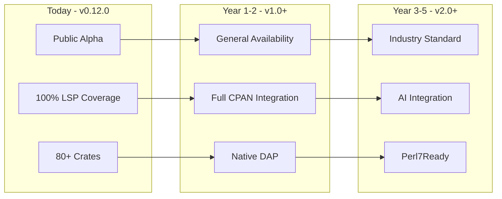
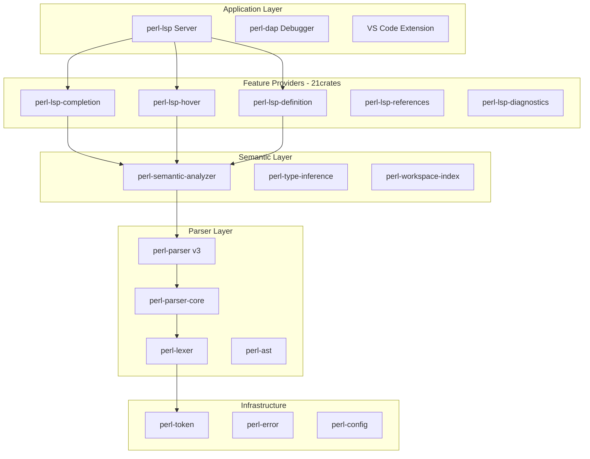
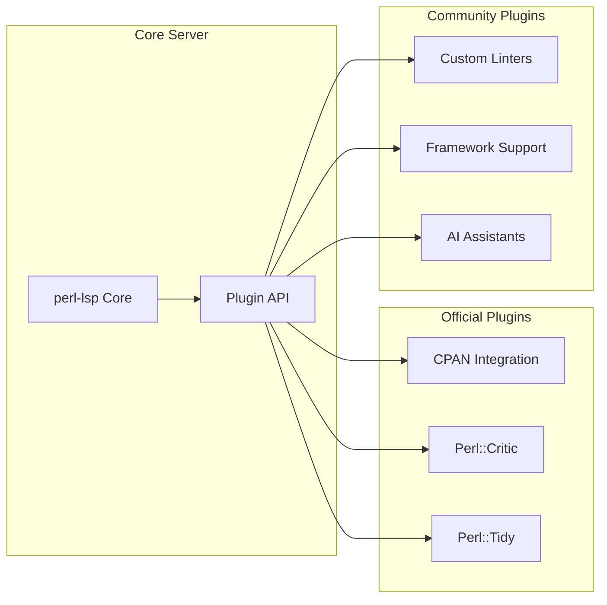
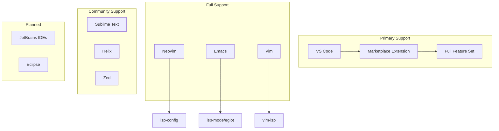
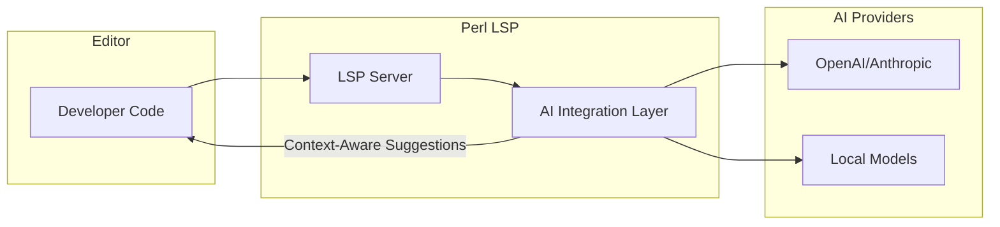

# Technical Vision

> **The Definitive Perl Development Tooling Platform**
>
> **Version**: v0.12.0 | **Last Updated**: 2026-03-28
> **Status**: Strategic Direction Document

---

## Executive Summary

This document articulates the long-term technical direction for the Perl LSP ecosystem—an 80+ crate Rust workspace forming a complete Perl development environment with Language Server Protocol (LSP), Debug Adapter Protocol (DAP), parser, and workspace tooling.

Our vision is to become **the definitive Perl development tooling platform** within 3-5 years, enabling every Perl developer to have a world-class IDE experience regardless of their editor choice, operating system, or project complexity.

---

## 1. Vision Statement

### The Definitive Perl Development Tooling Platform

**In 3-5 years, the Perl LSP ecosystem will be:**

- **The standard** for Perl IDE support, bundled with major editors and recommended by the Perl community
- **The reference implementation** for Language Server Protocol features tailored to dynamic languages
- **The foundation** for next-generation Perl tooling including AI-assisted development and advanced type inference
- **The bridge** between Perl5 legacy codebases and modern development practices



### Strategic Alignment

This vision aligns with and extends the strategic direction defined in:

| Document | Purpose | Relationship |
|----------|---------|--------------|
| [ROADMAP.md](ROADMAP.md) | Version milestones and deliverables | Tactical execution plan |
| [NOW_NEXT_LATER.md](NOW_NEXT_LATER.md) | Priority framework | Near-term focus areas |
| **TECHNICAL_VISION.md** | Long-term technical direction | Strategic north star |

---

## 2. Technical Principles

These core principles guide all technical decisions in the ecosystem.

### 2.1 Reliability First

**No crashes, ever.** The language server must be bulletproof.

| Practice | Implementation |
|----------|----------------|
| No panics | `unwrap()`, `expect()`, `panic!()`, `todo!()` banned in production code |
| Graceful degradation | Parser errors become diagnostics, not crashes |
| Error recovery | Continue parsing after syntax errors |
| Resource limits | Memory and CPU bounds enforced |

**Rationale**: A crashed language server disrupts developer flow. We prioritize stability over features.

### 2.2 Performance Matters

**Sub-millisecond responses for interactive operations.**

| Operation | Target | Rationale |
|-----------|--------|-----------|
| Incremental parse | <1ms | Typing must feel instant |
| Completion | <50ms p95 | No perceptible delay |
| Hover | <30ms p95 | Immediate feedback |
| Diagnostics | <100ms on save | Fast feedback loop |

**Rationale**: Performance is a feature. Developers abandon slow tools.

### 2.3 Perl Compatibility

**Support Perl 5.10 through 5.40+ with Perl 7 readiness.**

| Version | Support Level | Notes |
|---------|---------------|-------|
| Perl 5.10-5.18 | Legacy | Best-effort support |
| Perl 5.20-5.36 | Full | Complete syntax coverage |
| Perl 5.38-5.40+ | Primary | Modern syntax emphasis |
| Perl 7 | Planned | Preview mode in v1.1.0+ |

**Rationale**: Perl has a massive legacy codebase. Tools must support old and new code.

### 2.4 Developer Experience

**Seamless integration, zero configuration, instant productivity.**

- **Zero-config startup**: Works immediately after installation
- **Universal editor support**: VS Code, Neovim, Emacs, Vim, Sublime, JetBrains
- **Helpful diagnostics**: Clear error messages with fix suggestions
- **Progressive disclosure**: Basic features work simply; advanced features available

**Rationale**: Developers should spend time coding, not configuring tools.

### 2.5 Open Source Community

**Transparent development, community-driven priorities.**

| Practice | Implementation |
|----------|----------------|
| Open roadmap | Public ROADMAP.md with quarterly updates |
| Clear governance | CONTRIBUTING.md defines contribution process |
| Responsive triage | 24-hour response time on new issues |
| Documentation-first | API docs, guides, and tutorials maintained |

**Rationale**: Sustainable open source requires community trust and participation.

---

## 3. Architecture Vision

### 3.1 Microcrate Ecosystem Evolution

The 80+ crate architecture will evolve from organizational convenience to strategic advantage.



**Evolution Path**:

| Phase | Focus | Outcome |
|-------|-------|---------|
| Current | Organizational clarity | 80+ crates with clear boundaries |
| v1.0 | API stability | Contract-locked public interfaces |
| v1.5+ | Plugin architecture | Extensible via dynamic loading |
| v2.0+ | Language-agnostic core | Reusable for Raku/other dynamic languages |

### 3.2 Plugin/Extension Architecture

**Future capability for community extensions.**



**Plugin Capabilities** (v1.5+):

- Custom diagnostic providers
- Additional completion sources
- Custom code actions
- External tool integration
- Language extensions

### 3.3 Multi-Editor Support Strategy

**Universal editor coverage through LSP standard.**

| Editor | Strategy | Priority |
|--------|----------|----------|
| VS Code | Official extension | Primary |
| Neovim | nvim-lspconfig support | Full |
| Emacs | lsp-mode/eglot support | Full |
| Vim | vim-lsp community | Community |
| Sublime Text | LSP package | Community |
| JetBrains | Plugin development | Planned v1.0+ |
| Zed | LSP support | Planned |

### 3.4 Language Server Protocol Leadership

**Exceed LSP specification with Perl-specific optimizations.**

| Capability | LSP Standard | Our Implementation |
|------------|--------------|-------------------|
| Completion | Basic | Context-aware with type inference |
| Diagnostics | Syntax only | Semantic analysis + best practices |
| Navigation | File-level | Cross-file with package resolution |
| Refactoring | Basic rename | Safe refactoring with boundary detection |
| Performance | Unspecified | Sub-millisecond incremental updates |

---

## 4. Technology Radar

Technologies categorized by adoption status.

### 4.1 ADOPT — Proven, Use Everywhere

| Technology | Status | Notes |
|------------|--------|-------|
| **Rust** | Primary language | Memory safety, performance, zero-cost abstractions |
| **LSP 3.17+** | Protocol standard | Full compliance with 3.18 target for v1.0 |
| **DAP** | Debug standard | Native implementation replacing bridge |
| **Tokio** | Async runtime | Battle-tested, minimal dependencies |
| **Serde** | Serialization | Zero-cost serialization/deserialization |

### 4.2 TRIAL — Evaluating for Adoption

| Technology | Status | Evaluation Criteria |
|------------|--------|---------------------|
| **Tree-sitter** | Integration testing | Incremental parsing, error recovery |
| **WASM Plugins** | Architecture exploration | Safe sandboxing, cross-platform |
| **Ropey** | Text storage | Already adopted, optimizing usage |
| **async-lsp** | LSP framework | Evaluating vs custom implementation |

### 4.3 ASSESS — Monitoring for Future Use

| Technology | Status | Assessment Focus |
|------------|--------|------------------|
| **Perl 7 Syntax** | Monitoring | Spec stability, community adoption |
| **AI-Assisted Development** | Exploring | LSP integration patterns, model APIs |
| **LSP 3.19+** | Monitoring | New capabilities, editor support |
| **WebAssembly** | Exploring | Browser-based IDE support |

### 4.4 HOLD — Not Currently Pursuing

| Technology | Status | Rationale |
|------------|--------|-----------|
| **Legacy Pest Parser** | Deprecated | v3 recursive descent parser is superior |
| **C Interop** | Minimal | Pure Rust preferred for maintainability |
| **Perl Runtime Dependency** | Optional only | Zero-install parsing is core value prop |

---

## 5. Quality Targets

Measurable quality goals with current state and targets.

### 5.1 Code Quality Metrics

| Metric | Current | v0.15.0 Target | v1.0.0 Target | v2.0.0 Target |
|--------|---------|----------------|---------------|---------------|
| Mutation Score | 87% | 90% | 95% | 95%+ |
| Test Coverage | High | 85% | 90% | 95% |
| Documentation Coverage | High | 95% | 100% | 100% |
| Clippy Warnings | 0 | 0 | 0 | 0 |

### 5.2 Parser Quality Metrics

| Metric | Current | Target | Measurement |
|--------|---------|--------|-------------|
| Parse Success Rate | 99%+ | 99.9%+ | Corpus testing |
| Error Recovery Rate | 95%+ | 99%+ | Partial parse success |
| Incremental Reuse | 70-99% | 90%+ avg | Node reuse percentage |
| Syntax Coverage | ~100% | 100% | Perl construct coverage |

### 5.3 Performance Targets

| Operation | Current | v1.0.0 Target | v2.0.0 Target |
|-----------|---------|---------------|---------------|
| Incremental Parse | <1ms | <1ms | <0.5ms |
| Full Parse (2.5KB) | ~200µs | <150µs | <100µs |
| Completion Response | <50ms p95 | <30ms p95 | <20ms p95 |
| Hover Response | <30ms p95 | <20ms p95 | <10ms p95 |
| Workspace Index | ~370µs | <300µs | <200µs |
| LSP P99 Latency | <100ms | <100ms | <50ms |

### 5.4 Reliability Targets

| Metric | Target | Measurement |
|--------|--------|-------------|
| Uptime | 99.99% | No crashes per 10,000 hours |
| Memory Leaks | 0 | AddressSanitizer validation |
| Protocol Compliance | 100% | LSP specification coverage |
| Feature Coverage | 100% | Advertised capabilities delivered |

---

## 6. Integration Strategy

### 6.1 Editor Integrations



**Editor Support Matrix**:

| Editor | Install Method | Support Level | Native Features |
|--------|----------------|---------------|-----------------|
| VS Code | Marketplace | Official | All + Debugging |
| Neovim | nvim-lspconfig | Official | All + Debugging |
| Emacs | lsp-mode | Official | All + Debugging |
| Vim | vim-lsp | Community | All |
| Sublime | LSP package | Community | All |
| JetBrains | Plugin (v1.0+) | Planned | TBD |

### 6.2 Build System Integration

| Build System | Integration Type | Status |
|--------------|------------------|--------|
| Module::Build | Configuration awareness | Planned v0.13.0 |
| ExtUtils::MakeMaker | Configuration awareness | Planned v0.13.0 |
| Dist::Zilla | Plugin support | Planned v1.0.0 |
| Minilla | Configuration awareness | Planned v1.0.0 |
| Carton | cpanfile support | Planned v0.14.0 |

### 6.3 CI/CD Integration

| Platform | Integration | Status |
|----------|-------------|--------|
| GitHub Actions | Linting, diagnostics | Documented |
| GitLab CI | Linting, diagnostics | Documented |
| Jenkins | Custom integration | Community |
| CircleCI | Custom integration | Community |

**Integration Pattern**:

```yaml
# Example GitHub Actions integration
- name: Perl LSP Diagnostics
  run: perl-lsp --check --format github .
```

### 6.4 CPAN Ecosystem Connectivity

| Feature | Description | Target Version |
|---------|-------------|----------------|
| META.json parsing | Dependency resolution | v0.13.0 |
| cpanfile support | Dependency-aware completion | v0.14.0 |
| CPAN index | Offline module metadata | v1.0.0 |
| CPANSA integration | Security advisories | v1.0.0 |
| Module suggestions | Install recommendations | v1.1.0 |

---

## 7. Research & Innovation

Areas for future exploration and potential breakthrough features.

### 7.1 Advanced Type Inference

**Goal**: Derive types without explicit annotations in dynamic Perl code.

| Research Area | Challenge | Potential Impact |
|---------------|-----------|------------------|
| Flow analysis | Track types through control flow | Better completion, error detection |
| Constructor inference | Derive object types from `new()` calls | Accurate method completion |
| Subroutine signatures | Parse and use signature types | Parameter hints, validation |
| Type propagation | Track types across file boundaries | Workspace-wide type safety |

**Research Questions**:
- How to handle `bless` without explicit class information?
- Can we infer types from test files?
- How to integrate with Types::Standard, Zydeco?

### 7.2 AI-Powered Code Completion

**Goal**: Integrate AI assistants through LSP protocol.



**Integration Points**:
- Code completion with semantic context
- Documentation generation
- Test generation suggestions
- Refactoring recommendations

### 7.3 Security Vulnerability Detection

**Goal**: Detect security issues without execution.

| Detection Type | Examples | Approach |
|----------------|----------|----------|
| Taint analysis | Unvalidated input | Data flow tracking |
| Dangerous patterns | `system($user_input)` | Pattern matching |
| Dependency vulnerabilities | CVE scanning | CPANSA integration |
| Configuration issues | Insecure defaults | Best practice rules |

### 7.4 Performance Profiling Integration

**Goal**: Built-in profiling without external tools.

| Feature | Description | Value |
|---------|-------------|-------|
| Hot path identification | Highlight performance-critical code | Optimization guidance |
| Memory profiling | Track memory allocation patterns | Leak detection |
| Subroutine timing | Execution time estimates | Performance awareness |
| Database query detection | Identify N+1 patterns | Application optimization |

### 7.5 Perl 7 Preparation

**Goal**: Seamless transition to Perl 7 when released.

| Research Area | Status | Notes |
|---------------|--------|-------|
| Syntax changes | Monitoring | Spec not yet final |
| Feature flags | Planned | Experimental mode |
| Compatibility layer | Planned | Perl5 backward compatibility |
| Migration tooling | Future | Automated upgrade assistance |

---

## 8. Architecture Decision Records

Key architectural decisions that shape the technical direction.

### ADR-001: Rust as Primary Language

**Decision**: Build entire ecosystem in Rust.

**Rationale**:
- Memory safety without garbage collection
- Zero-cost abstractions for performance
- Strong type system for reliability
- Excellent tooling and ecosystem

**Consequences**:
- Steeper learning curve for contributors
- Longer compile times
- Excellent runtime performance

### ADR-002: Microcrate Architecture

**Decision**: Organize code into 80+ focused crates.

**Rationale**:
- Clear ownership boundaries
- Independent versioning capability
- Faster incremental compilation
- Future plugin architecture foundation

**Consequences**:
- Complex workspace management
- More boilerplate
- Better modularity and testability

### ADR-003: Zero Perl Runtime Dependency

**Decision**: Parse and analyze Perl without Perl installed.

**Rationale**:
- True zero-install experience
- No version compatibility issues
- Consistent behavior across environments
- Security through isolation

**Consequences**:
- Must implement full Perl parsing
- Cannot execute code for analysis
- Parser complexity is high

### ADR-004: LSP Protocol Compliance

**Decision**: 100% LSP specification compliance as non-negotiable.

**Rationale**:
- Editor interoperability
- Predictable behavior
- Community trust
- Future-proofing

**Consequences**:
- Must track specification changes
- Some features may be underutilized
- Clear compatibility guarantees

---

## 9. Success Indicators

### 3-Year Vision Metrics

| Indicator | Current | Year 1 | Year 2 | Year 3 |
|-----------|---------|--------|--------|--------|
| VS Code Installs | Growing | 5,000+ | 25,000+ | 100,000+ |
| crates.io Downloads | Active | 25,000+ | 100,000+ | 500,000+ |
| GitHub Stars | Growing | 1,000+ | 3,000+ | 10,000+ |
| Contributors | Active | 30+ | 75+ | 150+ |
| Editor Support | 3 official | 5 official | 7+ official | All major |

### Technical Excellence Indicators

| Indicator | Target |
|-----------|--------|
| Zero P0/P1 bugs | Always |
| Parse success rate | 99.9%+ |
| Server uptime | 99.99%+ |
| Response latency P99 | <100ms |
| Community NPS | 50+ |

---

## 10. Related Documentation

| Document | Purpose | Relationship |
|----------|---------|--------------|
| [ROADMAP.md](ROADMAP.md) | Version milestones | Tactical execution |
| [NOW_NEXT_LATER.md](NOW_NEXT_LATER.md) | Priority framework | Near-term focus |
| [AGENTS.md](AGENTS.md) | AI assistant guide | Development practices |
| [CONTRIBUTING.md](CONTRIBUTING.md) | Contribution guidelines | Community process |
| [docs/reference/](docs/reference/) | Technical references | Implementation details |

---

## 11. Document Governance

### Review Cadence

| Review Type | Frequency | Owner |
|-------------|-----------|-------|
| Full review | Quarterly | Architecture team |
| Metric update | Per release | Release team |
| Principle review | Annually | Core maintainers |

### Change Process

1. **Propose**: Open issue with `vision` label
2. **Discuss**: Community feedback period (2 weeks minimum)
3. **Approve**: Core maintainer consensus
4. **Document**: Update this file with rationale
5. **Communicate**: Release notes and announcements

---

## Related Documents

### Strategic Planning

| Document | Purpose |
|----------|---------|
| [ROADMAP.md](ROADMAP.md) | Version milestones and release planning |
| [NOW_NEXT_LATER.md](NOW_NEXT_LATER.md) | Current quarter priorities |
| [STRATEGIC_DOCUMENTATION.md](docs/STRATEGIC_DOCUMENTATION.md) | Index of all strategic documents |

### Architecture Decisions

| Document | Purpose |
|----------|---------|
| [docs/adr/](docs/adr/) | Architecture Decision Records |
| [ADR-0008](docs/adr/0008-microcrate-architecture.md) | Microcrate architecture (SRP) |
| [ADR-0012](docs/adr/0012-error-handling-strategy.md) | Error handling strategy (No Panics) |

### Technical References

| Document | Purpose |
|----------|---------|
| [CRATE_ARCHITECTURE_GUIDE.md](docs/reference/CRATE_ARCHITECTURE_GUIDE.md) | Workspace structure and crate tiers |
| [LSP_IMPLEMENTATION_GUIDE.md](docs/reference/LSP_IMPLEMENTATION_GUIDE.md) | LSP server implementation details |
| [COMMANDS_REFERENCE.md](docs/reference/COMMANDS_REFERENCE.md) | Build and test commands |
| [CURRENT_STATUS.md](docs/project/CURRENT_STATUS.md) | Current metrics and project health |

---

*This technical vision is a living document reflecting our aspirations and commitments. It evolves with the project and community.*

**Last Updated**: 2026-03-13 | **Next Review**: 2026-06-01
