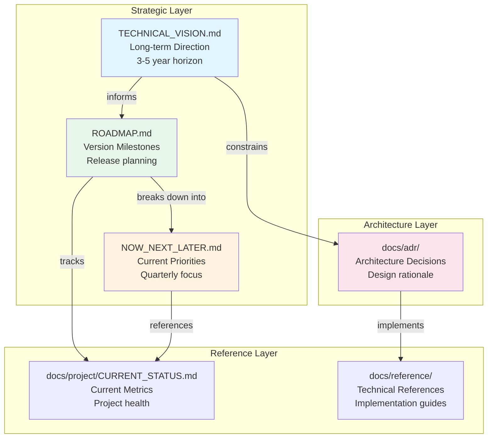

# Strategic Documentation Index

> **Purpose**: Navigation hub for all strategic planning documents

---

## Overview

This index provides a centralized navigation point for all strategic documentation in the Perl LSP project. These documents define the project's direction, priorities, and architectural decisions.

---

## Strategic Documents

### Core Planning Documents

| Document | Location | Purpose | Audience |
|----------|----------|---------|----------|
| **TECHNICAL_VISION.md** | [Root](../TECHNICAL_VISION.md) | Long-term technical direction (3-5 years) | Architects, Maintainers |
| **ROADMAP.md** | [Root](../ROADMAP.md) | Version milestones and deliverables | All stakeholders |
| **NOW_NEXT_LATER.md** | [Root](../NOW_NEXT_LATER.md) | Current quarter priorities | Contributors, Team leads |

### Architecture Decision Records

Located in [`docs/adr/`](adr/), these documents capture significant architectural decisions. The catalog below now highlights every ADR series currently present in the repository so recent decisions are discoverable from this strategic index as well as from the dedicated ADR README.

#### Legacy groundwork

| ADR | Title | Description |
|-----|-------|-------------|
| [0001](adr/0001-substitution-operator-parsing-architecture.md) | Substitution Operator Parsing | Comprehensive `s///` parsing across delimiter and modifier forms |
| [0002](adr/0002-api-documentation-infrastructure.md) | API Documentation Strategy | Early documentation enforcement and quality gate design |

#### Historical `ADR_00X` series

| ADR | Title | Description |
|-----|-------|-------------|
| [ADR-001](adr/ADR_001_AGENT_ARCHITECTURE.md) | Agent Architecture | Historical agent specialization model retained for context |
| [ADR-002](adr/ADR_002_API_DOCUMENTATION_INFRASTRUCTURE.md) | API Documentation (SPEC-149) | Documentation acceptance criteria and enforcement workflow |
| [ADR-003](adr/ADR_003_MISSING_DOCUMENTATION_INFRASTRUCTURE.md) | Missing Docs Infrastructure | Validation framework for missing-documentation coverage |
| [ADR-004](adr/ADR_004_EXECUTE_COMMAND_CODE_ACTIONS.md) | Execute Command & Code Actions | `workspace/executeCommand` and perlcritic integration design |
| [ADR-005](adr/ADR_005_HEREDOC_MANUAL_PARSING.md) | Manual Heredoc Parsing | Character-by-character heredoc parsing state machine |
| [ADR-006](adr/ADR_006_LSP_CANCELLATION_INFRASTRUCTURE.md) | LSP Cancellation Infrastructure | Cancellation checkpoints for responsive editor interactions |
| [ADR-007](adr/ADR_007_SUBSTITUTION_OPERATOR_PARSING.md) | Substitution Operator Parsing | Alternate-series record for the substitution parser decision |

#### Numbered architecture series

| ADR | Title | Description |
|-----|-------|-------------|
| [0008](adr/0008-microcrate-architecture.md) | Microcrate Architecture | 80+ small crates following SRP |
| [0009](adr/0009-dual-indexing-strategy.md) | Dual Indexing Strategy | Qualified and bare name indexing |
| [0010](adr/0010-incremental-parsing-architecture.md) | Incremental Parsing | <1ms update target |
| [0011](adr/0011-dap-bridge-mode-architecture.md) | DAP Bridge Mode | Debug Adapter Protocol bridge |
| [0012](adr/0012-error-handling-strategy.md) | Error Handling Strategy | No-panic reliability |
| [0013](adr/0013-utf16-position-tracking.md) | UTF-16 Position Tracking | Symmetric UTF-8/UTF-16 conversion with boundary safety |
| [0014](adr/0014-mode-aware-lexer.md) | Mode-Aware Lexer | Slash disambiguation via explicit lexer modes |
| [0015](adr/0015-supply-chain-security.md) | Supply Chain Security | SBOM/provenance strategy for release artifacts |
| [0016](adr/0016-feature-governance.md) | Feature Governance | LSP capability governance and rollout controls |
| [0017](adr/0017-workspace-exclusion-strategy.md) | Workspace Exclusion Strategy | Keep problematic crates out of the default workspace graph |
| [0018](adr/0018-adaptive-threading-tests.md) | Adaptive Threading for Tests | Thread-aware timeout scaling for reliable CI |
| [0019](adr/0019-security-first-dap.md) | Security-First DAP | Defensive debugger design and path protections |
| [0020](adr/0020-rope-document-management.md) | Rope Document Management | Rope-backed text storage for efficient position math |
| [0021](adr/0021-lsp-capability-contract.md) | LSP Capability Contract | Contract-driven capability advertisement policy |
| [0022](adr/0022-scope-analyzer-hash-context.md) | Scope Analyzer Hash Context | Accurate Perl hash-key context detection |
| [0023](adr/0023-include-macro-architecture.md) | `include!` Macro Architecture | Parser composition through Rust source inclusion |
| [0024](adr/0024-fifo-heredoc-queue.md) | FIFO Heredoc Queue | Ordered heredoc content collection during parsing |
| [0025](adr/0025-dual-document-representation.md) | Dual Document Representation | Rope plus string storage for mixed access patterns |
| [0026](adr/0026-lifecycle-index-routing.md) | Lifecycle Index Routing | Building/Ready/Degraded routing for indexing results |
| [0027](adr/0027-dap-bridge-native.md) | DAP Bridge vs Native | Phased debugger delivery strategy |
| [0028](adr/0028-safe-eval-timeout.md) | Safe Eval Timeout | Time-bounded debugger eval to prevent hangs and DoS |
| [0029](adr/0029-mutation-sentinel-values.md) | Mutation Sentinel Values | Sentinel-value strategy for mutation testing |
| [0030](adr/0030-receipt-gate-system.md) | Receipt Gate System | Machine-readable CI gate receipts |
| [0031](adr/0031-async-runtime-concurrent-dispatch.md) | Async Runtime with Concurrent Dispatch | Concurrent LSP scheduling with exclusive and shared lanes |
| [0032](adr/0032-skill-scoping-and-hook-enforcement.md) | Skill Scoping and Hook Enforcement | Frontmatter-gated skills plus enforced worker hooks |
| [0033](adr/0033-worktree-first-disposable-workers.md) | Worktree-First Disposable Workers | Fresh workers and worktree isolation for PR-sized changes |
| [0034](adr/0034-custom-lsp-runtime.md) | Custom LSP Runtime | Bespoke protocol/runtime stack instead of framework adoption |
| [0037](adr/0037-guaranteed-valid-uri-fallbacks.md) | Guaranteed-Valid Synthetic URI Fallbacks | Synthetic URI policy for malformed protocol-boundary values |
| [0039](adr/0039-raw-pointer-parent-map.md) | Raw-Pointer Parent Map | Sidecar parent cache for efficient upward AST traversal |
| [0040](adr/0040-generated-feature-catalog-contracts.md) | Generated Feature Catalog Contracts | Build-time compilation of `features.toml` into generated Rust contracts |

See [docs/adr/README.md](adr/README.md) for per-ADR status, dates, and the canonical index.

---

## Document Relationships

### How Documents Relate

1. **TECHNICAL_VISION.md** → **ROADMAP.md**: The vision defines the "why" and "where"; the roadmap defines the "when" and "what"
2. **ROADMAP.md** → **NOW_NEXT_LATER.md**: The roadmap spans all versions; NOW/NEXT/LATER focuses on immediate priorities
3. **TECHNICAL_VISION.md** → **ADRs**: Vision principles are codified in architectural decisions
4. **ROADMAP.md** ↔ **CURRENT_STATUS.md**: Roadmap targets are validated against current metrics
5. **ADRs** → **Reference Docs**: Decisions are implemented as documented patterns

---

## Navigation by Audience

### For Contributors

Start here to understand current priorities and how to contribute effectively:

1. **[NOW_NEXT_LATER.md](../NOW_NEXT_LATER.md)** — What's being worked on right now
2. **[ROADMAP.md](../ROADMAP.md)** — Where the project is heading
3. **[CONTRIBUTING.md](../CONTRIBUTING.md)** — How to contribute

### For Users

Understand the project's direction and stability:

1. **[ROADMAP.md](../ROADMAP.md)** — Upcoming features and releases
2. **[docs/reference/STABILITY.md](reference/STABILITY.md)** — API stability guarantees
3. **[docs/project/CURRENT_STATUS.md](project/CURRENT_STATUS.md)** — Current capabilities

### For Maintainers

Strategic planning and architectural oversight:

1. **[TECHNICAL_VISION.md](../TECHNICAL_VISION.md)** — Long-term technical direction
2. **[docs/adr/](adr/)** — Architecture decision records
3. **[ROADMAP.md](../ROADMAP.md)** — Release planning
4. **[docs/project/CURRENT_STATUS.md](project/CURRENT_STATUS.md)** — Project health metrics

### For Architects

Deep technical understanding and design patterns:

1. **[TECHNICAL_VISION.md](../TECHNICAL_VISION.md)** — Technical principles and vision
2. **[docs/adr/](adr/)** — All architecture decisions
3. **[docs/reference/CRATE_ARCHITECTURE_GUIDE.md](reference/CRATE_ARCHITECTURE_GUIDE.md)** — System architecture
4. **[docs/reference/LSP_IMPLEMENTATION_GUIDE.md](reference/LSP_IMPLEMENTATION_GUIDE.md)** — LSP implementation details

---

## Quick Reference

| Question | Document |
|----------|----------|
| What are we working on now? | [NOW_NEXT_LATER.md](../NOW_NEXT_LATER.md) |
| When will feature X be released? | [ROADMAP.md](../ROADMAP.md) |
| Why was decision Y made? | [docs/adr/](adr/) |
| Where is the project heading? | [TECHNICAL_VISION.md](../TECHNICAL_VISION.md) |
| What's the current project health? | [CURRENT_STATUS.md](project/CURRENT_STATUS.md) |
| How do I contribute? | [CONTRIBUTING.md](../CONTRIBUTING.md) |

---

## Document Maintenance

### Update Cadence

| Document | Update Frequency | Owner |
|----------|------------------|-------|
| NOW_NEXT_LATER.md | Quarterly | Project Lead |
| ROADMAP.md | Per release | Release Team |
| TECHNICAL_VISION.md | Annually | Architecture Team |
| ADRs | As needed | Decision Owner |
| CURRENT_STATUS.md | Per release | Automation |

### Related Documentation

- [docs/README.md](README.md) — Complete documentation index
- [CONTRIBUTING.md](../CONTRIBUTING.md) — Contribution guidelines
- [AGENTS.md](../AGENTS.md) — AI assistant development guide

---

*This index is maintained alongside the strategic documents it references.*
