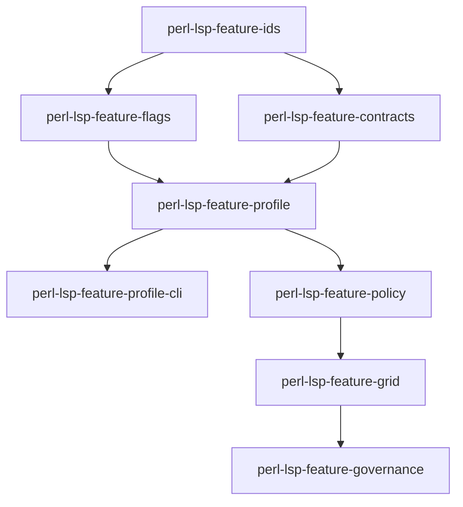

# ADR-0016: Feature Governance Subsystem

**Status**: Accepted
**Date**: 2025-02-15
**Decision Makers**: Perl LSP Architecture Team
**Related**: [WORKSPACE_ARCHITECTURE.md](../project/WORKSPACE_ARCHITECTURE.md), [LSP_CAPABILITY_POLICY.md](../reference/LSP_CAPABILITY_POLICY.md)

## Context

The LSP server implements 53+ distinct capabilities, each with different maturity levels, performance characteristics, and stability guarantees. Enterprise users require fine-grained control over which features are enabled, while developers need a structured approach to feature rollout and capability management.

### Problem Statement

1. **Feature Complexity**: 53+ LSP capabilities with varying maturity levels
2. **Enterprise Requirements**: Organizations need to disable unstable or resource-intensive features
3. **Gradual Rollout**: New features need controlled enablement
4. **Capability Tracking**: Need to distinguish advertised vs. implemented capabilities
5. **Policy Enforcement**: Constraints across the capability matrix must be enforced

### Capability Categories

| Category | Examples | Stability |
|----------|----------|-----------|
| Core | textDocument/completion, textDocument/definition | GA |
| Navigation | textDocument/references, textDocument/implementation | GA |
| Diagnostics | textDocument/publishDiagnostics | GA |
| Experimental | textDocument/semanticTokens | Beta |
| Resource-Intensive | textDocument/inlayHint | Configurable |

## Decision

**We implement a dedicated Feature Governance subsystem with 8 specialized crates providing feature identification, flag evaluation, capability contracts, profile definitions, and policy enforcement.**

### Crate Architecture

| Crate | Purpose |
|-------|---------|
| `perl-lsp-feature-ids` | Canonical feature identifiers |
| `perl-lsp-feature-flags` | Runtime feature flag evaluation |
| `perl-lsp-feature-contracts` | Feature capability contracts |
| `perl-lsp-feature-profile` | Feature profile definitions |
| `perl-lsp-feature-profile-cli` | CLI parsing for feature profiles |
| `perl-lsp-feature-policy` | Feature enablement policy engine |
| `perl-lsp-feature-grid` | Feature capability matrix |
| `perl-lsp-feature-governance` | Top-level governance orchestrator |

### Dependency Flow



### Core Components

#### Feature Identifiers (`perl-lsp-feature-ids`)

```rust
/// Canonical feature identifiers for all LSP capabilities
pub enum FeatureId {
    // Text Synchronization
    TextDocumentDidOpen,
    TextDocumentDidChange,
    TextDocumentDidSave,
    TextDocumentDidClose,
    
    // Language Features
    TextDocumentCompletion,
    TextDocumentHover,
    TextDocumentDefinition,
    TextDocumentReferences,
    TextDocumentDiagnostics,
    
    // Experimental
    TextDocumentSemanticTokens,
    TextDocumentInlayHint,
}
```

#### Feature Flags (`perl-lsp-feature-flags`)

```rust
/// Runtime feature flag evaluation
pub struct FeatureFlags {
    flags: HashMap<FeatureId, FeatureState>,
}

impl FeatureFlags {
    /// Check if a feature is enabled
    pub fn is_enabled(&self, id: FeatureId) -> bool;
    
    /// Enable a feature
    pub fn enable(&mut self, id: FeatureId);
    
    /// Disable a feature
    pub fn disable(&mut self, id: FeatureId);
}
```

#### Capability Contracts (`perl-lsp-feature-contracts`)

```rust
/// Feature capability contract defining requirements and guarantees
pub struct CapabilityContract {
    /// Feature identifier
    pub id: FeatureId,
    /// Minimum stability level
    pub stability: StabilityLevel,
    /// Required dependencies
    pub dependencies: Vec<FeatureId>,
    /// Resource requirements
    pub resources: ResourceRequirements,
}
```

#### Policy Engine (`perl-lsp-feature-policy`)

```rust
/// Feature enablement policy engine
pub struct PolicyEngine {
    policies: Vec<Policy>,
}

impl PolicyEngine {
    /// Evaluate if a feature can be enabled given current state
    pub fn evaluate(&self, id: FeatureId, context: &Context) -> PolicyResult;
    
    /// Apply policy constraints to feature set
    pub fn apply_constraints(&self, features: &mut FeatureSet);
}
```

### Feature Profiles

Predefined profiles for common use cases:

| Profile | Description | Features Enabled |
|---------|-------------|------------------|
| `full` | All available features | All GA + Beta |
| `ga-core` | Proven stable features | GA only |
| `minimal` | Essential features only | Core subset |
| `custom` | User-defined selection | Per configuration |

### Contract-Driven Capability Advertisement

From [LSP_CAPABILITY_POLICY.md](../reference/LSP_CAPABILITY_POLICY.md):

> A capability is advertised only after its acceptance tests land.

```rust
// Main branch: full surface (only features with passing tests)
// Conservative point release: build with --features lsp-ga-lock
```

## Consequences

### Positive

1. **Separation of Concerns**: Implementation separated from advertisement
2. **Gradual Rollout**: New features can be disabled by default
3. **Enterprise Control**: Fine-grained feature management
4. **Testing Isolation**: Features can be tested independently
5. **Resource Management**: Resource-intensive features can be disabled
6. **Contract Enforcement**: Automated validation of capability requirements

### Negative

1. **Complexity**: 8 additional crates increase workspace size
2. **Indirection**: Feature checks go through governance layer
3. **Maintenance**: Profile definitions must be kept current
4. **Learning Curve**: Developers must understand governance model

### Mitigations

- Clear documentation for each crate's responsibility
- Sensible defaults with `full` profile for development
- Automated contract validation in CI/CD

## Implementation

### Usage Example

```rust
use perl_lsp_feature_governance::{Governance, Profile};

// Create governance with full profile
let governance = Governance::new(Profile::Full);

// Check if feature is enabled
if governance.is_enabled(FeatureId::TextDocumentSemanticTokens) {
    // Provide semantic tokens
}

// Apply custom profile
let custom_profile = Profile::from_config(&config)?;
let governance = Governance::new(custom_profile);
```

### CLI Integration

```bash
# Run with GA core features only
perl-lsp --features ga-core

# Run with specific features enabled
perl-lsp --enable semanticTokens,inlayHint

# Run with specific features disabled
perl-lsp --disable inlayHint
```

### CI Integration

```bash
# Default: full feature set
cargo test --workspace

# GA lock: conservative feature set
cargo test -p perl-parser --features lsp-ga-lock --test lsp_capabilities_contract_lock
```

## Feature Governance Workflow

### Adding a New Capability

1. Implement feature in `crates/perl-lsp-*/src/`
2. Add acceptance tests in `crates/perl-lsp-*/tests/`
3. Define feature contract in `perl-lsp-feature-contracts`
4. Add feature ID to `perl-lsp-feature-ids`
5. Update capability advertisement in `lsp_server.rs`
6. Update the [capability status index](../project/status/index.md) and README.md

### Feature Stability Levels

| Level | Description | Default |
|-------|-------------|---------|
| `Experimental` | Under development, may change | Disabled |
| `Beta` | Feature complete, needs testing | Disabled |
| `GA` | Production ready, stable API | Enabled |
| `Deprecated` | Planned removal | Disabled |

## References

- [Workspace Architecture](../project/WORKSPACE_ARCHITECTURE.md)
- [LSP Capability Policy](../reference/LSP_CAPABILITY_POLICY.md)
- [features.toml](../../features.toml) - Feature tracking configuration
