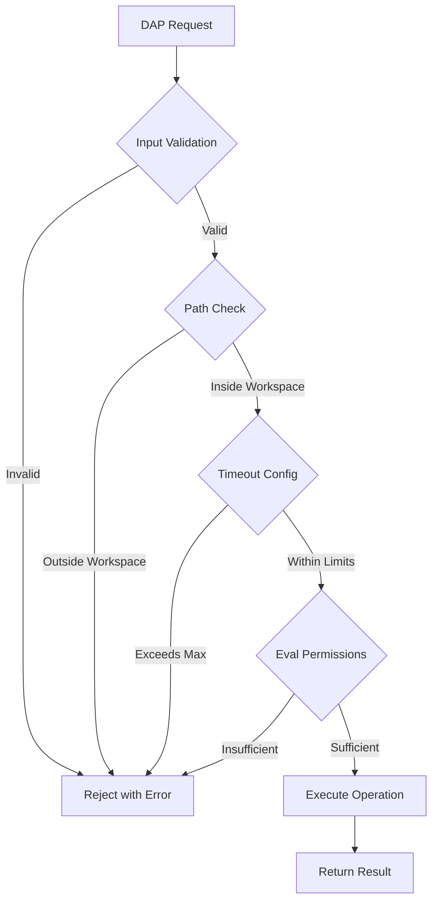

# ADR-0019: Security-First DAP Architecture

**Status**: Accepted
**Date**: 2025-06-15
**Decision Makers**: Perl LSP Architecture Team
**Related**: [DAP_SECURITY_SPECIFICATION.md](../DAP_SECURITY_SPECIFICATION.md), [CRATE_ARCHITECTURE_GUIDE.md](../reference/CRATE_ARCHITECTURE_GUIDE.md)

## Context

The Debug Adapter Protocol (DAP) implementation provides debugging capabilities for Perl code, which inherently requires elevated privileges and access to sensitive operations. Debugging infrastructure faces unique security challenges:

1. **Code Execution**: Evaluating expressions during debugging
2. **File Access**: Reading source files and setting breakpoints
3. **Process Control**: Starting, stopping, and inspecting running processes
4. **Data Exposure**: Access to variable values and program state

### Threat Model

| Attack Vector | Example | Impact |
|---------------|---------|--------|
| **Path Traversal** | `file:///workspace/../../../etc/passwd` | Unauthorized file access |
| **Code Injection** | Malicious eval expressions | Arbitrary code execution |
| **DoS via Infinite Loop** | Endless debugging sessions | Resource exhaustion |
| **Unicode Exploits** | Malformed UTF-16 boundaries | Security bypass |

## Decision

**We implement enterprise-grade security with defense in depth: path traversal prevention, safe evaluation defaults, timeout enforcement, and Unicode boundary safety.**

### Security Domains

#### 1. Path Traversal Prevention

```rust
/// Validate breakpoint path is within workspace boundaries
pub fn validate_breakpoint_path(uri: &str, workspace_root: &Path) -> Result<PathBuf> {
    // Convert URI to filesystem path
    let path = uri_to_path(uri)?;

    // Canonicalize path (resolves symlinks, normalizes separators)
    let canonical = path.canonicalize()
        .map_err(|e| SecurityError::InvalidPath(format!("Cannot canonicalize {}: {}", uri, e)))?;

    // Ensure path is within workspace boundaries
    if !canonical.starts_with(workspace_root) {
        bail!(SecurityError::PathTraversalAttempt {
            requested: uri.to_string(),
            canonical: canonical.display().to_string(),
            workspace: workspace_root.display().to_string(),
        });
    }

    Ok(canonical)
}
```

**Platform-Specific Validation**:
- **Windows**: UNC path validation, drive letter normalization
- **Unix**: Symlink resolution, workspace boundary enforcement

#### 2. Safe Evaluation Defaults

```rust
/// Evaluation configuration with safe defaults
pub struct EvalConfig {
    /// Non-mutating evaluation by default
    pub read_only: bool,  // Default: true
    /// Timeout for evaluation
    pub timeout_ms: u64,  // Default: 5000
    /// Allowed operations
    pub allowed_ops: HashSet<EvalOp>,
}
```

**Default Restrictions**:
- Read-only evaluation (no side effects)
- Explicit opt-in for mutating operations
- Expression sanitization before execution

**Security Note**: Safe evaluation provides syntactic validation (admission control) that blocks
known dangerous operations, but it does **not provide interpreter isolation** or OS-level sandboxing.
Expressions are still evaluated in the debugger context. This is one layer of defense; timeout
enforcement provides DoS protection as a complementary measure.

#### 3. Timeout Enforcement

```rust
/// Hard timeout preventing DoS from infinite loops
pub const DEFAULT_EVAL_TIMEOUT_MS: u64 = 5000;
pub const MAX_EVAL_TIMEOUT_MS: u64 = 30000;

pub fn enforce_timeout<F, T>(f: F, timeout_ms: u64) -> Result<T>
where
    F: FnOnce() -> T,
{
    let timeout = Duration::from_millis(timeout_ms.min(MAX_EVAL_TIMEOUT_MS));
    // Execute with timeout enforcement
}
```

#### 4. Unicode Boundary Safety

Leveraging PR #153 infrastructure for symmetric UTF-16 ↔ UTF-8 conversion:
- Boundary validation for all position conversions
- Surrogate pair handling for emoji and CJK characters
- Safe slicing of multibyte sequences

#### 5. Input Validation

```rust
/// Expression sanitization and code injection prevention
pub fn sanitize_expression(expr: &str) -> Result<SanitizedExpr> {
    // Check for dangerous patterns
    check_for_shell_commands(expr)?;
    check_for_system_calls(expr)?;
    check_for_file_operations(expr)?;
    
    Ok(SanitizedExpr::new(expr))
}
```

### Security Architecture



## Consequences

### Positive

- **Enterprise-Ready**: Security suitable for corporate environments
- **Defense in Depth**: Multiple security layers prevent single-point failures
- **Compliance**: Zero security findings in CI/CD security scanner gate
- **Audit Trail**: Clear security boundaries for compliance reporting
- **Safe Defaults**: Users protected without explicit configuration

### Negative

- **Reduced Flexibility**: Some debugging operations require explicit opt-in
- **Performance Overhead**: Security checks add latency to operations
- **Complexity**: Additional abstraction for security validation

### Mitigations

- Clear documentation for enabling advanced features
- Performance-optimized validation paths
- Configurable security levels for different environments

## Security Compliance

| Domain | Control | Validation |
|--------|---------|------------|
| Path Traversal | Canonical validation | AC16 test suite |
| Safe Evaluation | Read-only default | Unit + integration tests |
| Timeout Enforcement | Hard limits | DoS test scenarios |
| Unicode Safety | Boundary validation | PR #153 infrastructure |
| Input Validation | Expression sanitization | Injection test cases |

## References

- [DAP_SECURITY_SPECIFICATION.md](../DAP_SECURITY_SPECIFICATION.md) - Complete security specification
- [CRATE_ARCHITECTURE_GUIDE.md](../reference/CRATE_ARCHITECTURE_GUIDE.md) - DAP crate architecture
- [SECURITY_DEVELOPMENT_GUIDE.md](../how-to/SECURITY_DEVELOPMENT_GUIDE.md) - Security development practices
