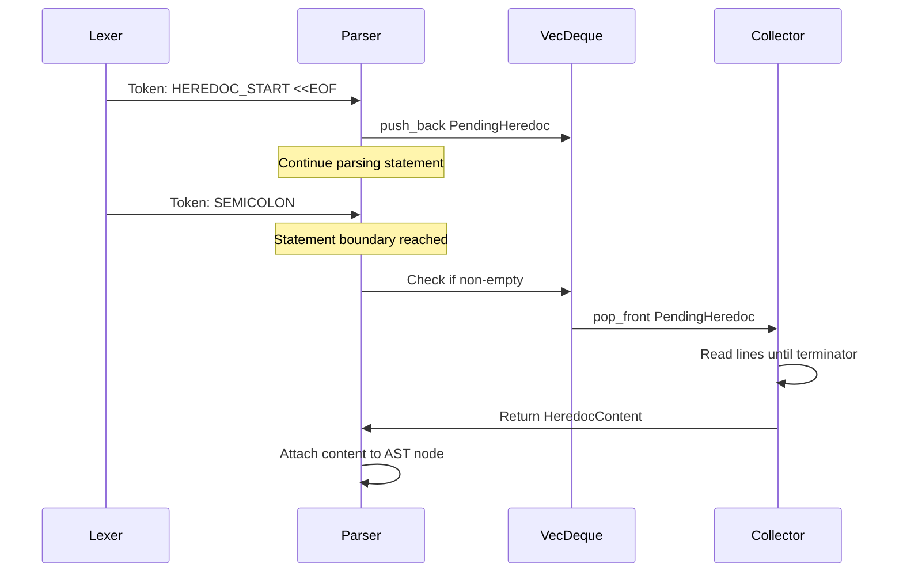

# ADR-0024: FIFO Heredoc Queue Design

**Status**: Accepted
**Date**: 2025-02-20
**Decision Makers**: Perl LSP Architecture Team
**Related**: [ADR-0005](ADR_005_HEREDOC_MANUAL_PARSING.md)

## Context

Perl heredocs present a unique parsing challenge: the declaration (`<<EOF`) appears lexically before its content, but the content physically starts on the next line. This creates a temporal mismatch:

```perl
my $text = <<EOF;  # Declaration at line 1
content here       # Content at line 2
EOF                # Terminator at line 3
```

### The Heredoc Problem

Traditional parsing approaches struggle with heredocs:

1. **Two-Pass Parsing**: First pass collects declarations, second pass collects content
   - Requires storing entire source in memory
   - Breaks streaming scenarios
   - Complex state management

2. **Lookahead Parsing**: Parser looks ahead to find content
   - Breaks single-pass design
   - Complicates error recovery
   - Performance overhead

3. **Deferred Content Collection**: Queue declarations, collect after statement ends
   - Maintains single-pass design
   - Natural statement boundary semantics
   - Requires careful queue management

### Perl's Heredoc Complexity

Perl heredocs have several features that complicate parsing:

- **Multiple Declarations**: `my ($a, $b) = (<<E1, <<E2);`
- **Indented Heredocs**: `<<~EOF` strips leading whitespace
- **Interpolation Control**: `<<'EOF'` (no interpolation) vs `<<"EOF"` (interpolation)
- **Nested Heredocs**: Heredocs within heredoc content
- **Empty Content**: Heredocs with only a terminator

## Decision

**We use a FIFO (First-In-First-Out) queue implemented with `VecDeque` to collect heredoc bodies after statement parsing, enabling single-pass parsing while handling Perl's heredoc complexity.**

### Queue Architecture

```rust
use std::collections::VecDeque;

pub struct Parser<'a> {
    // ... other fields ...
    
    /// FIFO queue of pending heredoc declarations awaiting content collection
    pending_heredocs: VecDeque<PendingHeredoc>,
    
    /// Source bytes for heredoc content collection
    src_bytes: &'a [u8],
    
    /// Byte cursor tracking position for heredoc content collection
    byte_cursor: usize,
}

/// Represents a heredoc declaration waiting for content collection
pub struct PendingHeredoc {
    /// The terminator label (e.g., "EOF")
    pub label: Arc<str>,
    /// Whether to strip leading whitespace (<<~)
    pub allow_indent: bool,
    /// Quote kind determining interpolation behavior
    pub quote_kind: QuoteKind,
    /// Byte offset where content collection should start
    pub content_start: usize,
}
```

### Collection Flow



### Key Implementation Details

1. **FIFO Order**: Heredocs are collected in declaration order
   ```perl
   my ($a, $b) = (<<FIRST, <<SECOND);
   content of FIRST
   FIRST
   content of SECOND
   SECOND
   ```

2. **Statement Boundary Trigger**: Collection happens when statement parsing completes
   ```rust
   fn parse_statement(&mut self) -> Result<Statement> {
       let stmt = self.parse_statement_inner()?;
       
       // Collect heredoc content at statement boundary
       if !self.pending_heredocs.is_empty() {
           self.collect_heredocs()?;
       }
       
       Ok(stmt)
   }
   ```

3. **Content Collection Algorithm**:
   ```rust
   fn collect_heredocs(&mut self) -> Result<Vec<HeredocContent>> {
       let mut contents = Vec::new();
       
       while let Some(pending) = self.pending_heredocs.pop_front() {
           let content = self.collect_single_heredoc(pending)?;
           contents.push(content);
       }
       
       Ok(contents)
   }
   ```

### Performance Characteristics

| Metric | Value |
|--------|-------|
| **Queue Operations** | O(1) push/pop via VecDeque |
| **Memory Overhead** | O(n) where n = pending heredocs |
| **Content Collection** | O(k) where k = heredoc content length |
| **Typical Queue Depth** | 1-3 for most Perl code |

## Consequences

### Positive

- **Single-Pass Parsing**: No need for multiple passes over source
- **Streaming Compatible**: Can parse incrementally with proper boundaries
- **Natural Semantics**: Collection at statement end matches Perl's behavior
- **Memory Efficient**: Only stores pending declarations, not entire source
- **Error Recovery**: Failed collection doesn't corrupt parser state

### Negative

- **State Management**: Parser must track queue across parsing operations
- **Statement Awareness**: Must identify statement boundaries correctly
- **Nested Complexity**: Deeply nested heredocs require careful handling
- **Error Positioning**: Errors in heredoc content may have confusing positions

### Mitigations

- Clear documentation of statement boundary semantics
- Comprehensive error messages with position tracking
- Timeout enforcement for pathological heredoc nesting (5-second limit)
- Bounded recursion depth for nested heredocs (100 levels max)

## References

- [crates/perl-parser-core/src/engine/parser/mod.rs](../../crates/perl-parser-core/src/engine/parser/mod.rs) - Parser implementation
- [crates/perl-parser-core/src/syntax/heredoc.rs](../../crates/perl-parser-core/src/syntax/heredoc.rs) - Heredoc collection library
- [ADR-0005: Manual Heredoc Parsing](ADR_005_HEREDOC_MANUAL_PARSING.md) - Related heredoc parsing approach
- [Perl heredoc documentation](https://perldoc.perl.org/perlop#Quote-and-Quote-like-Operators)
