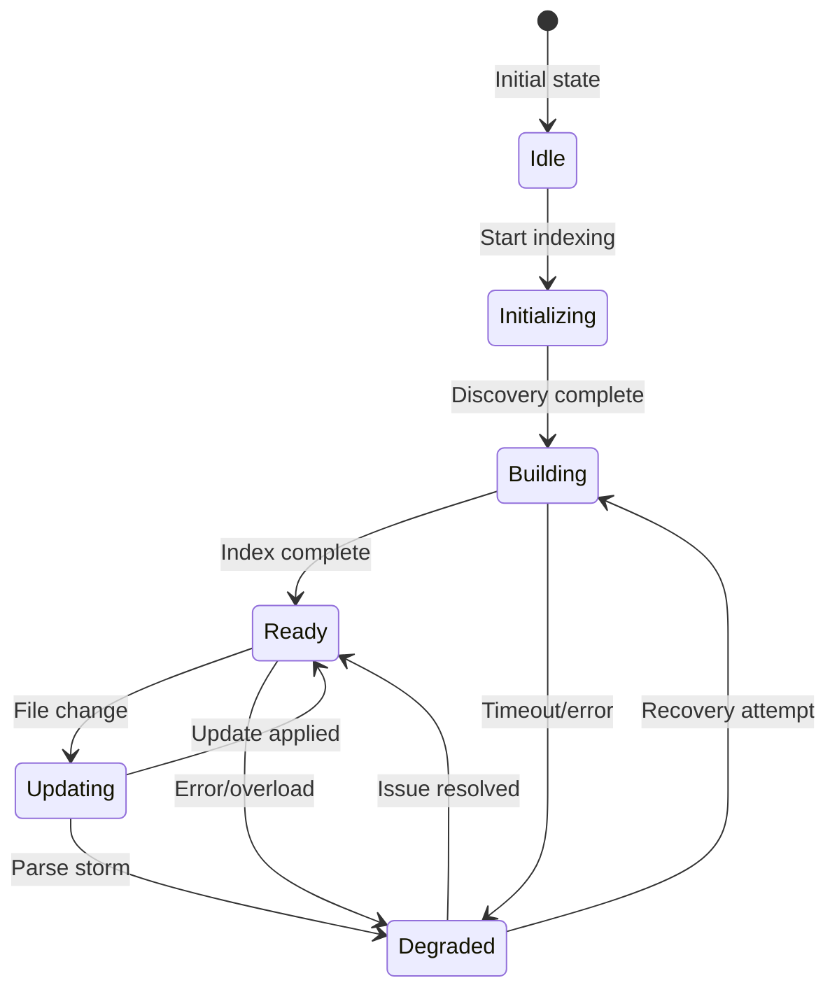

# ADR-0026: Lifecycle-Aware Index Routing

**Status**: Accepted
**Date**: 2025-02-20
**Decision Makers**: Perl LSP Architecture Team
**Related**: [ADR-0009](0009-dual-indexing-strategy.md)

## Context

LSP servers must remain responsive during workspace indexing, which can take seconds to minutes for large projects. During this time, the server must still handle:

1. **Document Edits**: User typing, paste operations
2. **Feature Requests**: Hover, completion, definition lookups
3. **Diagnostics**: Syntax error reporting
4. **Workspace Queries**: Symbol search, references

### The Responsiveness Problem

Without lifecycle awareness:
- Index building blocks the main thread
- Feature requests timeout during indexing
- Users experience editor lag
- Partial results are unavailable

### Index Lifecycle Phases

A workspace index goes through distinct phases:



## Decision

**We implement a state machine (Building → Ready → Degraded) with graceful degradation, routing requests to appropriate handlers based on current index state.**

### State Machine Architecture

```rust
/// Index readiness state - explicit lifecycle management
#[derive(Clone, Debug, PartialEq)]
pub enum IndexState {
    /// Index is being constructed (workspace scan in progress)
    Building {
        indexed_count: usize,
        total_count: usize,
        started_at: Instant,
    },
    
    /// Index is consistent and ready for queries
    Ready {
        file_count: usize,
        symbol_count: usize,
        completed_at: Instant,
    },
    
    /// Index is serving but degraded (partial functionality)
    Degraded {
        reason: DegradationReason,
        available_symbols: usize,
        since: Instant,
    },
}

/// Reasons for index degradation
#[derive(Clone, Debug, PartialEq)]
pub enum DegradationReason {
    /// Too many pending parses (parse storm)
    ParseStorm { pending_parses: usize },
    /// Resource limit exceeded
    ResourceLimit { kind: ResourceKind },
    /// I/O error during indexing
    IoError { message: String },
    /// Index build timeout
    ScanTimeout { elapsed_ms: u64 },
}
```

### Request Routing Strategy

```rust
impl IndexCoordinator {
    /// Route request based on current index state
    pub fn route_query<T>(&self, query: Query) -> QueryResult<T> {
        match self.state() {
            IndexState::Ready { .. } => {
                // Full query path - complete index available
                self.execute_full_query(query)
            }
            IndexState::Building { indexed_count, .. } => {
                // Partial query path - use indexed portion + open documents
                self.execute_partial_query(query, indexed_count)
            }
            IndexState::Degraded { available_symbols, .. } => {
                // Degraded query path - limited but functional
                self.execute_degraded_query(query, available_symbols)
            }
        }
    }
}
```

### Handler Behavior by State

| State | Hover | Completion | Definition | References | Workspace Symbol |
|-------|-------|------------|------------|------------|------------------|
| **Building** | Open docs | Open docs | Open docs | Open docs | Partial (indexed) |
| **Ready** | Full | Full | Full | Full | Full |
| **Degraded** | Cached | Cached | Cached | Limited | Limited |

### Graceful Degradation Examples

```rust
// Definition lookup with graceful degradation
fn goto_definition(&self, params: GotoDefinitionParams) -> Option<Location> {
    match self.coordinator.state() {
        IndexState::Ready { .. } => {
            // Full cross-file definition lookup
            self.index.find_definition(&params)
        }
        IndexState::Building { .. } => {
            // Fallback: same-file definition only
            self.current_file_find_definition(&params)
                .or_else(|| self.open_docs_find_definition(&params))
        }
        IndexState::Degraded { available_symbols, .. } => {
            // Limited: cached definitions only
            self.cache_find_definition(&params, available_symbols)
        }
    }
}
```

### Parse Storm Detection

```rust
/// Threshold for parse storm detection
const PARSE_STORM_THRESHOLD: usize = 10;

impl IndexCoordinator {
    /// Track file changes and detect parse storms
    pub fn on_file_change(&mut self, path: PathBuf) {
        self.pending_parses.push(path);
        
        if self.pending_parses.len() > PARSE_STORM_THRESHOLD {
            self.transition_to_degraded(DegradationReason::ParseStorm {
                pending_parses: self.pending_parses.len(),
            });
        }
    }
    
    /// Recover from parse storm when queue drains
    pub fn on_parse_complete(&mut self) {
        self.pending_parses.pop();
        
        if self.pending_parses.is_empty() {
            if matches!(self.state(), IndexState::Degraded { 
                reason: DegradationReason::ParseStorm { .. }, 
                .. 
            }) {
                self.transition_to_ready();
            }
        }
    }
}
```

### Performance Characteristics

| Metric | Ready State | Building State | Degraded State |
|--------|-------------|----------------|----------------|
| Query latency | <10ms | <50ms (partial) | <100ms (cached) |
| Memory usage | Full index | Partial + queue | Cached subset |
| CPU usage | Low | High (indexing) | Medium (draining) |
| Availability | 100% | 99% (degraded) | 95% (limited) |

## Consequences

### Positive

- **Always Responsive**: LSP never blocks during indexing
- **Predictable Behavior**: Clear state transitions and expectations
- **Automatic Recovery**: Parse storms self-resolve
- **User Experience**: Editor remains usable during large workspace scans
- **Resource Management**: Degradation prevents memory/CPU exhaustion

### Negative

- **Complexity**: State machine adds architectural complexity
- **Partial Results**: Users may get incomplete results during Building
- **Testing Overhead**: Must test all state transitions
- **Documentation**: Users need to understand degraded behavior

### Mitigations

- Clear progress reporting during Building state
- Documentation of degraded mode limitations
- Comprehensive state transition testing
- Metrics and logging for state changes

## References

- [crates/perl-workspace/src/workspace/state_machine.rs](../../crates/perl-workspace/src/workspace/state_machine.rs) - State machine implementation
- [crates/perl-parser/tests/index_lifecycle_tests.rs](../../crates/perl-parser/tests/index_lifecycle_tests.rs) - Lifecycle tests
- [ADR-0009: Dual Indexing Strategy](0009-dual-indexing-strategy.md) - Related indexing approach
- [LSP Server Implementation Guide](../reference/LSP_IMPLEMENTATION_GUIDE.md)
