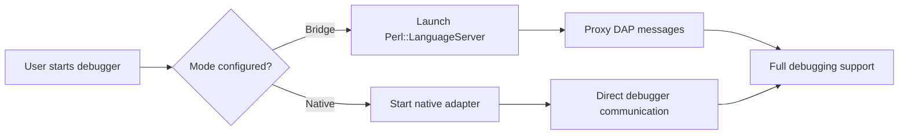

# ADR-0027: DAP Bridge vs Native Mode

**Status**: Accepted
**Date**: 2025-02-20
**Decision Makers**: Perl LSP Architecture Team
**Related**: [ADR-0011](0011-dap-bridge-mode-architecture.md), [ADR-0019](0019-security-first-dap.md)

## Context

The Debug Adapter Protocol (DAP) implementation faces a build-vs-buy decision:

1. **Native Implementation**: Full Rust implementation of Perl debugging
   - Complete control over behavior
   - No external dependencies
   - Significant development effort
   - Must match Perl debugger semantics exactly

2. **Bridge Mode**: Proxy to existing Perl::LanguageServer
   - Leverages mature, tested implementation
   - Immediate functionality
   - Dependency on Perl installation
   - Limited to Perl::LanguageServer capabilities

3. **Hybrid Approach**: Bridge mode initially, native mode as goal
   - Best of both worlds
   - Migration path required
   - Complexity in supporting both

### Perl Debugging Complexity

Perl debugging is complex due to:
- Dynamic code evaluation (`eval STRING`)
- Symbol table manipulation
- Tied variables and magic
- XS module interactions
- Multiple debugger backends

## Decision

**We implement a phased approach: bridge mode for immediate value, native mode as the default with socket transport, allowing transparent upgrade path.**

### Mode Architecture

```rust
/// DAP operating mode configuration
#[derive(Clone, Debug, PartialEq)]
pub enum DapMode {
    /// Bridge mode: proxy DAP requests to Perl::LanguageServer
    Bridge,
    /// Native mode: direct Perl debugger integration via socket
    Native,
}

/// DAP server configuration
pub struct DapConfig {
    /// Operating mode (bridge or native)
    pub mode: DapMode,
    /// Port for native mode socket transport
    pub port: u16,
    /// Evaluation timeout in milliseconds
    pub evaluation_timeout_ms: u32,
}
```

### Phase 1: Bridge Mode (Immediate Value)

```rust
impl DapServer {
    /// Run in bridge mode - proxy to Perl::LanguageServer
    pub fn run_bridge(&mut self) -> Result<()> {
        tracing::info!("Starting DAP server in bridge mode");
        
        let rt = tokio::runtime::Runtime::new()?;
        rt.block_on(async {
            // Spawn Perl::LanguageServer process
            let mut perl_ls = Command::new("perl")
                .arg("-MPerl::LanguageServer")
                .arg("-e")
                .arg("Perl::LanguageServer->run")
                .stdin(Stdio::piped())
                .stdout(Stdio::piped())
                .spawn()?;
            
            // Bridge DAP messages between client and Perl::LanguageServer
            self.bridge_messages(&mut perl_ls).await
        })
    }
}
```

### Phase 2: Native Mode (Default)

```rust
impl DapServer {
    /// Run in native mode - direct Perl debugger integration
    pub fn run_socket(&mut self, port: u16) -> Result<()> {
        if self.config.mode == DapMode::Bridge {
            anyhow::bail!("Socket transport is not supported in bridge mode");
        }
        
        // Native implementation with socket transport
        let listener = TcpListener::bind(format!("127.0.0.1:{}", port))?;
        
        for stream in listener.incoming() {
            match stream {
                Ok(stream) => self.handle_native_connection(stream)?,
                Err(e) => tracing::error!("Connection failed: {}", e),
            }
        }
        
        Ok(())
    }
}
```

### Feature Comparison

| Feature | Bridge Mode | Native Mode |
|---------|-------------|-------------|
| **Setup** | Requires Perl + module | Self-contained |
| **Startup** | ~2s (Perl startup) | ~100ms |
| **Performance** | Good | Better |
| **Breakpoints** | Full support | Full support |
| **Variables** | Full support | Enhanced parsing |
| **Evaluation** | Via Perl | Safe evaluation |
| **Stack Trace** | Full support | Full support |
| **Threads** | Limited | Full control |
| **Security** | Perl sandbox | Rust sandbox |

### Migration Path



### Command Line Interface

```bash
# Bridge mode (default for backward compatibility)
perl-dap --bridge

# Native mode with socket transport
perl-dap --socket 4711

# Native mode (default in future)
perl-dap
```

## Consequences

### Positive

- **Immediate Value**: Users can debug Perl code today with bridge mode
- **Transparent Upgrade**: Switch modes without changing workflow
- **Risk Mitigation**: Native mode issues don't block initial release
- **Feature Parity**: Bridge mode provides complete DAP support
- **Performance Path**: Native mode offers better performance potential

### Negative

- **Dual Maintenance**: Must support both modes during transition
- **Bridge Dependencies**: Requires Perl and Perl::LanguageServer
- **Migration Complexity**: Users may need to update configurations
- **Testing Overhead**: Must test both modes thoroughly

### Mitigations

- Clear documentation of mode differences
- Deprecation timeline for bridge mode
- Automated testing for both modes
- Feature detection for graceful fallback

## References

- [crates/perl-dap/src/lib.rs](../../crates/perl-dap/src/lib.rs) - DAP implementation
- [crates/perl-dap/src/main.rs](../../crates/perl-dap/src/main.rs) - CLI entry point
- [ADR-0011: DAP Bridge Mode Architecture](0011-dap-bridge-mode-architecture.md) - Original bridge design
- [ADR-0019: Security-First DAP](0019-security-first-dap.md) - Security considerations
- [DAP User Guide](../tutorials/DAP_USER_GUIDE.md) - User documentation
