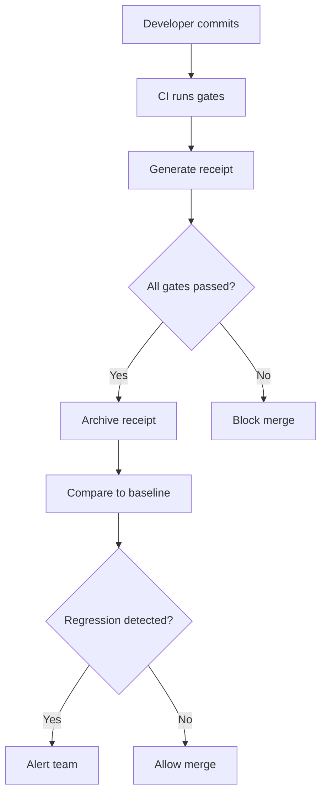

# ADR-0030: Receipt-Based Gate System

**Status**: Accepted
**Date**: 2025-02-20
**Decision Makers**: Perl LSP Architecture Team
**Related**: [CONTRIBUTING.md](../../CONTRIBUTING.md), [docs/RELEASE_PROCESS.md](../RELEASE_PROCESS.md)

## Context

CI/CD pipelines for large Rust workspaces face several challenges:

1. **Result Verification**: How do we know a gate actually passed?
2. **Baseline Comparison**: How do current results compare to previous runs?
3. **Performance Regression**: Did build times or test durations increase?
4. **Debugging**: What exactly happened during the gate execution?
5. **Audit Trail**: Can we reconstruct what ran and when?

### The Verification Problem

Traditional CI output is:
- **Ephemeral**: Logs disappear after retention period
- **Unstructured**: Text output, hard to parse programmatically
- **Incomparable**: No standard format for comparing runs
- **Incomplete**: May not capture all relevant metrics

### Gate Execution Context

Each CI gate has important metadata:

| Attribute | Example | Purpose |
|-----------|---------|---------|
| Gate ID | `ci-gate`, `ci-full` | Unique identifier |
| Command | `just ci-gate` | What was executed |
| Exit Code | 0, 1, 2 | Pass/fail status |
| Duration | 45.3 seconds | Performance tracking |
| Timestamp | 2025-02-20T10:30:00Z | When it ran |
| Commit SHA | `abc123` | What version |
| Environment | local, github-actions | Where it ran |

## Decision

**We generate machine-readable receipts (JSON/YAML) for all CI gates, enabling baseline comparison, performance regression detection, and structured debugging.**

### Receipt Format

```json
{
  "receipt_version": "1.0",
  "timestamp": "2025-02-20T10:30:00Z",
  "commit_sha": "abc123def456",
  "executor": "github-actions",
  "overall_status": "passed",
  "policy_path": "ci/gate-policy.yaml",
  "gates": [
    {
      "name": "ci-gate",
      "command": "just ci-gate",
      "required": true,
      "status": "passed",
      "exit_code": 0,
      "duration_seconds": 45.3,
      "log_path": "target/receipts/logs/ci-gate.log"
    },
    {
      "name": "ci-full",
      "command": "just ci-full",
      "required": false,
      "status": "skipped",
      "exit_code": null,
      "duration_seconds": null,
      "log_path": null
    }
  ],
  "debt_status": "clean",
  "environment": {
    "rust_version": "1.75.0",
    "os": "linux",
    "ci": true
  }
}
```

### Receipt Generation Script

```bash
#!/usr/bin/env bash
# scripts/run-gates.sh - Run merge gates and emit receipt JSON

RECEIPTS_DIR="target/receipts"
LOG_DIR="$RECEIPTS_DIR/logs"

mkdir -p "$LOG_DIR"

declare -a gate_ids gate_commands gate_required gate_status gate_exit_codes gate_durations

run_gate() {
  local gate_id="$1"
  local gate_cmd="$2"
  local required="$3"
  local log_path="$LOG_DIR/${gate_id}.log"
  
  echo "==> Running ${gate_id}: ${gate_cmd}"
  local start end duration exit_code status
  start=$(date +%s.%N)
  
  set +e
  (cd "$ROOT" && bash -lc "$gate_cmd") 2>&1 | tee "$log_path"
  exit_code=${PIPESTATUS[0]}
  set -e
  
  end=$(date +%s.%N)
  duration=$(echo "$end - $start" | bc)
  
  if [[ "$exit_code" -eq 0 ]]; then
    status="passed"
  else
    status="failed"
  fi
  
  gate_ids+=("$gate_id")
  gate_commands+=("$gate_cmd")
  gate_required+=("$required")
  gate_status+=("$status")
  gate_exit_codes+=("$exit_code")
  gate_durations+=("$duration")
}

# Run gates
run_gate "ci-gate" "just ci-gate" "true"

# Generate receipt JSON
receipt_path="$RECEIPTS_DIR/receipt.json"
{
  echo "{"
  echo "  \"receipt_version\": \"1.0\","
  echo "  \"timestamp\": \"$(date -Iseconds)\","
  echo "  \"gates\": ["
  
  for i in "${!gate_ids[@]}"; do
    printf "    {\"name\":\"%s\",\"status\":\"%s\",\"exit_code\":%s,\"duration_seconds\":%s}" \
      "${gate_ids[$i]}" "${gate_status[$i]}" "${gate_exit_codes[$i]}" "${gate_durations[$i]}"
    
    if [[ $i -lt $(( ${#gate_ids[@]} - 1 )) ]]; then
      echo ","
    fi
  done
  
  echo ""
  echo "  ]"
  echo "}"
} > "$receipt_path"

echo "Receipt written to: $receipt_path"
```

### Receipt Types

| Receipt Type | Purpose | Location |
|--------------|---------|----------|
| Gate Receipt | CI gate execution results | `target/receipts/receipt.json` |
| Build Timing | Build performance metrics | `artifacts/build-timing-receipt.json` |
| Test Summary | Test results summary | `artifacts/test-summary.json` |
| State Receipt | Consolidated state | `artifacts/state.json` |

### Usage Patterns

#### 1. Baseline Comparison

```bash
# Compare current build to baseline
./scripts/compare-build-timing.sh \
  artifacts/build-timing-baseline.json \
  artifacts/build-timing-receipt.json
```

#### 2. Performance Regression Detection

```python
# scripts/benchmarks/alert.py
def check_regression(current_receipt, baseline_receipt, threshold=0.1):
    current = load_receipt(current_receipt)
    baseline = load_receipt(baseline_receipt)
    
    for gate in current['gates']:
        baseline_gate = find_gate(baseline, gate['name'])
        if baseline_gate:
            increase = (gate['duration_seconds'] - baseline_gate['duration_seconds']) / baseline_gate['duration_seconds']
            if increase > threshold:
                alert(f"Performance regression in {gate['name']}: {increase:.1%} slower")
```

#### 3. Audit Trail

```bash
# Publish receipts for review
./scripts/publish-receipts.sh
# Creates: review/receipts/2025-02-20/
#   - ci-gate.log
#   - generate-receipts.log
#   - artifacts/state.json
#   - README.md
```

### Receipt-Driven Workflows



## Consequences

### Positive

- **Verifiable Results**: Machine-readable proof of gate execution
- **Performance Tracking**: Historical data for trend analysis
- **Debugging Support**: Structured logs with context
- **Audit Compliance**: Permanent record of CI execution
- **Automation Friendly**: JSON format enables tooling

### Negative

- **Storage Overhead**: Receipts consume disk space
- **Generation Time**: Small overhead for receipt creation
- **Format Maintenance**: Schema may need versioning
- **Tool Dependency**: Requires receipt processing tools

### Mitigations

- Receipt rotation policy (keep last N runs)
- Lightweight JSON format
- Schema versioning for backward compatibility
- Standard tools for receipt processing

## References

- [scripts/run-gates.sh](../../scripts/run-gates.sh) - Gate execution with receipts
- [scripts/generate-receipt.sh](../../scripts/generate-receipt.sh) - Single gate receipt
- [scripts/generate-receipts.sh](../../scripts/generate-receipts.sh) - Batch receipt generation
- [scripts/compare-build-timing.sh](../../scripts/compare-build-timing.sh) - Baseline comparison
- [scripts/publish-receipts.sh](../../scripts/publish-receipts.sh) - Receipt publishing
- [docs/RELEASE_PROCESS.md](../RELEASE_PROCESS.md) - Release workflow
