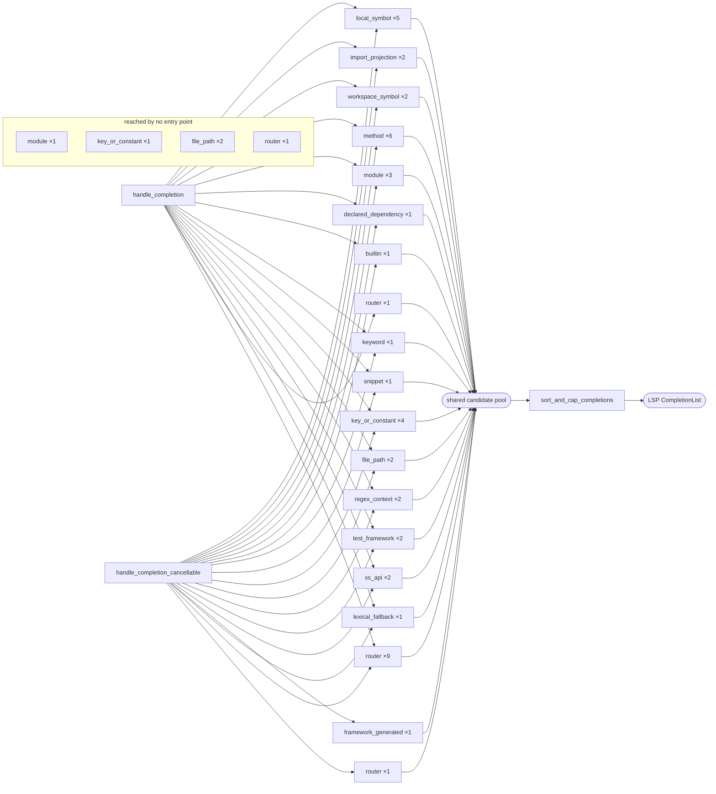

<!-- auto-generated by `cargo xtask completion-candidates graph`; do not edit -->

# Completion candidate producer inventory

Generated from `policy/completion-candidate-producers.toml` reconciled against the completion surface's real source. That file is the authority; this page is a projection of it. Edit the ledger and run `cargo xtask completion-candidates graph`.

Controlling issue #10949. The one live application route is #10229, pure merge/rank/cap is #10914, and source completeness is #10230. This inventory changes no completion behavior.

## Source binding

The dispositions below were audited against this exact source. A change to any file listed here invalidates the audit and `check` fails until the rows are re-checked.

- Digest: `sha256:155573075c249a0fdfb6e3743b5e3b361a724d7096c9f65e20721bccc48e671b`
- Files (42):
  - `crates/perl-lsp-rs-core/src/providers/completion/completion.rs`
  - `crates/perl-lsp-rs-core/src/providers/completion/completion/builtins.rs`
  - `crates/perl-lsp-rs-core/src/providers/completion/completion/builtins/catalog.rs`
  - `crates/perl-lsp-rs-core/src/providers/completion/completion/builtins/metadata.rs`
  - `crates/perl-lsp-rs-core/src/providers/completion/completion/context.rs`
  - `crates/perl-lsp-rs-core/src/providers/completion/completion/file_path.rs`
  - `crates/perl-lsp-rs-core/src/providers/completion/completion/functions.rs`
  - `crates/perl-lsp-rs-core/src/providers/completion/completion/import_map.rs`
  - `crates/perl-lsp-rs-core/src/providers/completion/completion/import_map/runtime_imports.rs`
  - `crates/perl-lsp-rs-core/src/providers/completion/completion/import_map/symbols.rs`
  - `crates/perl-lsp-rs-core/src/providers/completion/completion/import_map/used_modules.rs`
  - `crates/perl-lsp-rs-core/src/providers/completion/completion/items.rs`
  - `crates/perl-lsp-rs-core/src/providers/completion/completion/keywords.rs`
  - `crates/perl-lsp-rs-core/src/providers/completion/completion/lexical_context.rs`
  - `crates/perl-lsp-rs-core/src/providers/completion/completion/lexical_visibility.rs`
  - `crates/perl-lsp-rs-core/src/providers/completion/completion/methods.rs`
  - `crates/perl-lsp-rs-core/src/providers/completion/completion/packages.rs`
  - `crates/perl-lsp-rs-core/src/providers/completion/completion/regex_patterns.rs`
  - `crates/perl-lsp-rs-core/src/providers/completion/completion/request/context.rs`
  - `crates/perl-lsp-rs-core/src/providers/completion/completion/request/dispatch.rs`
  - `crates/perl-lsp-rs-core/src/providers/completion/completion/request/mod.rs`
  - `crates/perl-lsp-rs-core/src/providers/completion/completion/request/test_frameworks.rs`
  - `crates/perl-lsp-rs-core/src/providers/completion/completion/scope_distance.rs`
  - `crates/perl-lsp-rs-core/src/providers/completion/completion/snippets.rs`
  - `crates/perl-lsp-rs-core/src/providers/completion/completion/sort.rs`
  - `crates/perl-lsp-rs-core/src/providers/completion/completion/test_more.rs`
  - `crates/perl-lsp-rs-core/src/providers/completion/completion/variables.rs`
  - `crates/perl-lsp-rs-core/src/providers/completion/completion/workspace.rs`
  - `crates/perl-lsp-rs-core/src/providers/completion/completion/xs_api.rs`
  - `crates/perl-lsp-rs-core/src/providers/completion/completion_shadow.rs`
  - `crates/perl-lsp-rs-core/src/providers/completion/mod.rs`
  - `crates/perl-lsp-rs-core/src/providers/completion/module_scan_cache.rs`
  - `crates/perl-lsp-rs-core/src/providers/completion_item/candidate.rs`
  - `crates/perl-lsp-rs-core/src/providers/completion_item/mod.rs`
  - `crates/perl-lsp-rs-core/src/providers/completion_item/snippet.rs`
  - `crates/perl-lsp-rs-core/src/providers/completion_item/stable_order.rs`
  - `crates/perl-lsp-rs-core/src/providers/dancer2/completion.rs`
  - `crates/perl-lsp-rs-core/src/providers/file_completion/mod.rs`
  - `crates/perl-lsp-rs-core/src/providers/htmx/catalog.rs`
  - `crates/perl-lsp-rs-core/src/providers/htmx/markup.rs`
  - `crates/perl-lsp-rs-core/src/providers/htmx/mod.rs`
  - `crates/perl-lsp-rs/src/runtime/language/completion.rs`

## Denominator

A producer is a function taking the shared `&mut Vec<CompletionItem>` append channel. A file that constructs candidates without exposing one must carry a `construction_only` row saying which producer owns its output.

| Population | Count |
| --- | --- |
| producers | 58 |
| candidate classes | 18 |
| construction-only files | 0 |
| delegated modules | 2 |
| entry points | 2 |
| post-finalizer appends | 0 |

## Producers

| Producer | Class | Seam | Tier | Identity | Insertion | Evidence | Rank | Completeness | Finalizer route | Reached by | Owner |
| --- | --- | --- | --- | --- | --- | --- | --- | --- | --- | --- | --- |
| `perl_lsp_rs_core::providers::completion::completion::functions::add_function_completions` | local_symbol | append | core_provider | legacy_label_compatibility | legacy_compatibility | current_document_generation | compatibility_with_exit | legacy_unreported | compatibility_adapter_before_shared_finalizer | handle_completion, handle_completion_cancellable | #11002 |
| `perl_lsp_rs_core::providers::completion::completion::packages::add_local_package_completions` | local_symbol | append | core_provider | legacy_label_compatibility | legacy_compatibility | current_document_generation | compatibility_with_exit | legacy_unreported | compatibility_adapter_before_shared_finalizer | handle_completion, handle_completion_cancellable | #11002 |
| `perl_lsp_rs_core::providers::completion::completion::variables::add_all_variables` | local_symbol | append | core_provider | legacy_label_compatibility | legacy_compatibility | current_document_generation | compatibility_with_exit | legacy_unreported | compatibility_adapter_before_shared_finalizer | handle_completion, handle_completion_cancellable | #11002 |
| `perl_lsp_rs_core::providers::completion::completion::variables::add_special_variables` | local_symbol | append | core_provider | legacy_label_compatibility | legacy_compatibility | static_server_metadata | compatibility_with_exit | legacy_unreported | compatibility_adapter_before_shared_finalizer | handle_completion, handle_completion_cancellable | #11021 |
| `perl_lsp_rs_core::providers::completion::completion::variables::add_variable_completions` | local_symbol | append | core_provider | legacy_label_compatibility | legacy_compatibility | current_document_generation | compatibility_with_exit | legacy_unreported | compatibility_adapter_before_shared_finalizer | handle_completion, handle_completion_cancellable | #11002 |
| `perl_lsp_rs_core::providers::completion::completion::workspace::add_use_qw_import_completions` | import_projection | append | core_provider | legacy_label_compatibility | legacy_compatibility | current_document_generation | compatibility_with_exit | legacy_unreported | compatibility_adapter_before_shared_finalizer | handle_completion, handle_completion_cancellable | #1701 |
| `perl_lsp_rs_core::providers::completion::completion::workspace::add_visible_symbol_completions` | import_projection | append | core_provider | legacy_label_compatibility | legacy_compatibility | current_document_generation | compatibility_with_exit | legacy_unreported | compatibility_adapter_before_shared_finalizer | handle_completion, handle_completion_cancellable | #1701 |
| `perl_lsp_rs::runtime::language::completion::LspServer::add_runtime_workspace_completions` | workspace_symbol | append | runtime_enrichment | legacy_label_compatibility | legacy_compatibility | bounded_fallback | compatibility_with_exit | legacy_unreported | compatibility_adapter_before_shared_finalizer | handle_completion, handle_completion_cancellable | #11009 |
| `perl_lsp_rs_core::providers::completion::completion::workspace::add_workspace_symbol_completions` | workspace_symbol | append | core_provider | legacy_label_compatibility | legacy_compatibility | bounded_fallback | compatibility_with_exit | legacy_unreported | compatibility_adapter_before_shared_finalizer | handle_completion, handle_completion_cancellable | #11009 |
| `perl_lsp_rs_core::providers::completion::completion::CompletionProvider::add_object_pad_constructor_completions` | method | append | core_provider | legacy_label_compatibility | legacy_compatibility | current_document_generation | compatibility_with_exit | legacy_unreported | compatibility_adapter_before_shared_finalizer | handle_completion, handle_completion_cancellable | #15014 |
| `perl_lsp_rs_core::providers::completion::completion::methods::add_method_completions` | method | append | core_provider | legacy_label_compatibility | legacy_compatibility | current_document_generation | compatibility_with_exit | legacy_unreported | compatibility_adapter_before_shared_finalizer | handle_completion, handle_completion_cancellable | #8958 |
| `perl_lsp_rs_core::providers::completion::completion::workspace::add_semantic_method_completions` | method | append | core_provider | legacy_label_compatibility | legacy_compatibility | accepted_semantic_snapshot | compatibility_with_exit | legacy_unreported | compatibility_adapter_before_shared_finalizer | handle_completion, handle_completion_cancellable | #8958 |
| `perl_lsp_rs_core::providers::completion::completion::workspace::add_union_receiver_method_completions` | method | append | core_provider | legacy_label_compatibility | legacy_compatibility | accepted_semantic_snapshot | compatibility_with_exit | legacy_unreported | compatibility_adapter_before_shared_finalizer | handle_completion, handle_completion_cancellable | #8958 |
| `perl_lsp_rs_core::providers::completion::completion::workspace::add_unknown_receiver_fallback` | method | append | core_provider | legacy_label_compatibility | legacy_compatibility | bounded_fallback | compatibility_with_exit | legacy_unreported | compatibility_adapter_before_shared_finalizer | handle_completion, handle_completion_cancellable | #8958 |
| `perl_lsp_rs_core::providers::completion::completion::workspace::add_workspace_method_completions` | method | append | core_provider | legacy_label_compatibility | legacy_compatibility | bounded_fallback | compatibility_with_exit | legacy_unreported | compatibility_adapter_before_shared_finalizer | handle_completion, handle_completion_cancellable | #8958 |
| `perl_lsp_rs_core::providers::completion::completion::packages::add_known_core_module_completions` | module | append | core_provider | legacy_label_compatibility | legacy_compatibility | static_server_metadata | compatibility_with_exit | legacy_unreported | compatibility_adapter_before_shared_finalizer | handle_completion, handle_completion_cancellable | #11015 |
| `perl_lsp_rs_core::providers::completion::completion::packages::add_package_completions` | module | append | core_provider | legacy_label_compatibility | legacy_compatibility | current_document_generation | compatibility_with_exit | legacy_unreported | compatibility_adapter_before_shared_finalizer | handle_completion, handle_completion_cancellable | #11015 |
| `perl_lsp_rs_core::providers::completion::completion::workspace::add_use_module_completions` | module | append | core_provider | legacy_label_compatibility | legacy_compatibility | bounded_fallback | compatibility_with_exit | legacy_unreported | compatibility_adapter_before_shared_finalizer |  | #11015 |
| `perl_lsp_rs_core::providers::completion::completion::workspace::add_use_module_completions_with_cache` | module | append | core_provider | legacy_label_compatibility | legacy_compatibility | bounded_fallback | compatibility_with_exit | legacy_unreported | compatibility_adapter_before_shared_finalizer | handle_completion, handle_completion_cancellable | #11015 |
| `perl_lsp_rs::runtime::language::completion::LspServer::add_declared_dependency_completions` | declared_dependency | append | runtime_enrichment | legacy_label_compatibility | legacy_compatibility | bounded_fallback | compatibility_with_exit | legacy_unreported | compatibility_adapter_before_shared_finalizer | handle_completion, handle_completion_cancellable | #11009 |
| `perl_lsp_rs_core::providers::completion::completion::builtins::add_builtin_completions` | builtin | append | core_provider | legacy_label_compatibility | legacy_compatibility | static_server_metadata | compatibility_with_exit | legacy_unreported | compatibility_adapter_before_shared_finalizer | handle_completion, handle_completion_cancellable | #11021 |
| `perl_lsp_rs_core::providers::completion::completion::keywords::add_keyword_completions` | keyword | append | core_provider | legacy_label_compatibility | legacy_compatibility | static_server_metadata | compatibility_with_exit | legacy_unreported | compatibility_adapter_before_shared_finalizer | handle_completion, handle_completion_cancellable | #11021 |
| `perl_lsp_rs_core::providers::completion::completion::snippets::add_snippet_completions` | snippet | append | core_provider | legacy_label_compatibility | legacy_compatibility | static_server_metadata | compatibility_with_exit | legacy_unreported | compatibility_adapter_before_shared_finalizer | handle_completion, handle_completion_cancellable | #11021 |
| `perl_lsp_rs_core::providers::completion::completion::CompletionProvider::add_has_option_completions` | key_or_constant | append | core_provider | legacy_label_compatibility | legacy_compatibility | static_server_metadata | compatibility_with_exit | legacy_unreported | compatibility_adapter_before_shared_finalizer | handle_completion, handle_completion_cancellable | #15014 |
| `perl_lsp_rs_core::providers::completion::completion::CompletionProvider::add_has_type_completions` | key_or_constant | append | core_provider | legacy_label_compatibility | legacy_compatibility | current_document_generation | compatibility_with_exit | legacy_unreported | compatibility_adapter_before_shared_finalizer | handle_completion, handle_completion_cancellable | #15014 |
| `perl_lsp_rs_core::providers::completion::completion::CompletionProvider::add_hash_key_completions` | key_or_constant | append | core_provider | legacy_label_compatibility | legacy_compatibility | current_document_generation | compatibility_with_exit | legacy_unreported | compatibility_adapter_before_shared_finalizer | handle_completion, handle_completion_cancellable | #9478 |
| `perl_lsp_rs_core::providers::htmx::complete_attribute_names` | key_or_constant | returned | core_provider | legacy_label_compatibility | legacy_compatibility | static_server_metadata | compatibility_with_exit | legacy_unreported | compatibility_adapter_before_shared_finalizer |  | #15014 |
| `perl_lsp_rs_core::providers::htmx::complete_header_names` | key_or_constant | returned | core_provider | legacy_label_compatibility | legacy_compatibility | static_server_metadata | compatibility_with_exit | complete_or_empty | compatibility_adapter_before_shared_finalizer | handle_completion, handle_completion_cancellable | #15014 |
| `perl_lsp_rs_core::providers::completion::completion::CompletionProvider::add_file_completions` | file_path | append ×2 | core_provider | legacy_label_compatibility | legacy_compatibility | bounded_fallback | compatibility_with_exit | legacy_unreported | compatibility_adapter_before_shared_finalizer |  | #10234 |
| `perl_lsp_rs_core::providers::completion::completion::CompletionProvider::add_file_completions_with_cancellation` | file_path | append ×2 | core_provider | legacy_label_compatibility | legacy_compatibility | bounded_fallback | compatibility_with_exit | legacy_unreported | compatibility_adapter_before_shared_finalizer |  | #10234 |
| `perl_lsp_rs_core::providers::completion::completion::file_path::complete_file_paths` | file_path | returned | core_provider | legacy_label_compatibility | legacy_compatibility | bounded_fallback | compatibility_with_exit | legacy_unreported | compatibility_adapter_before_shared_finalizer | handle_completion, handle_completion_cancellable | #10234 |
| `perl_lsp_rs_core::providers::file_completion::complete_file_paths` | file_path | returned ×2 | core_provider | legacy_label_compatibility | legacy_compatibility | bounded_fallback | compatibility_with_exit | legacy_unreported | compatibility_adapter_before_shared_finalizer | handle_completion, handle_completion_cancellable | #10234 |
| `perl_lsp_rs_core::providers::completion::completion::regex_patterns::add_regex_completions` | regex_context | append | core_provider | legacy_label_compatibility | legacy_compatibility | static_server_metadata | compatibility_with_exit | legacy_unreported | compatibility_adapter_before_shared_finalizer | handle_completion, handle_completion_cancellable | #15014 |
| `perl_lsp_rs_core::providers::completion::completion::regex_patterns::add_regex_flag_completions` | regex_context | append | core_provider | legacy_label_compatibility | legacy_compatibility | static_server_metadata | compatibility_with_exit | legacy_unreported | compatibility_adapter_before_shared_finalizer | handle_completion, handle_completion_cancellable | #15014 |
| `perl_lsp_rs_core::providers::completion::completion::request::test_frameworks::reconcile` | test_framework | append | core_provider | legacy_label_compatibility | legacy_compatibility | current_document_generation | compatibility_with_exit | legacy_unreported | compatibility_adapter_before_shared_finalizer | handle_completion, handle_completion_cancellable | #15014 |
| `perl_lsp_rs_core::providers::completion::completion::test_more::add_test_more_completions` | test_framework | append | core_provider | legacy_label_compatibility | legacy_compatibility | static_server_metadata | compatibility_with_exit | legacy_unreported | compatibility_adapter_before_shared_finalizer | handle_completion, handle_completion_cancellable | #15014 |
| `perl_lsp_rs_core::providers::completion::completion::xs_api::add_xs_api_completions` | xs_api | append | core_provider | legacy_label_compatibility | legacy_compatibility | static_server_metadata | compatibility_with_exit | legacy_unreported | compatibility_adapter_before_shared_finalizer | handle_completion, handle_completion_cancellable | #15014 |
| `perl_lsp_rs_core::providers::completion::completion::xs_api::add_xs_api_completions_for_prefix` | xs_api | append | core_provider | legacy_label_compatibility | legacy_compatibility | static_server_metadata | compatibility_with_exit | legacy_unreported | compatibility_adapter_before_shared_finalizer | handle_completion, handle_completion_cancellable | #15014 |
| `perl_lsp_rs::runtime::language::completion::LspServer::add_dancer2_keyword_completions` | framework_generated | append | runtime_enrichment | legacy_label_compatibility | legacy_compatibility | accepted_semantic_snapshot | compatibility_with_exit | legacy_unreported | compatibility_adapter_before_shared_finalizer | handle_completion_cancellable | #15014 |
| `perl_lsp_rs::runtime::language::completion::LspServer::lexical_complete` | lexical_fallback | returned | runtime_enrichment | legacy_label_compatibility | legacy_compatibility | bounded_fallback | compatibility_with_exit | legacy_unreported | compatibility_adapter_before_shared_finalizer | handle_completion, handle_completion_cancellable | #15014 |
| `perl_lsp_rs_core::providers::completion::completion::CompletionProvider::get_completions` | router | returned | core_provider | not_applicable | not_applicable | not_applicable | not_applicable | legacy_unreported | compatibility_adapter_before_shared_finalizer |  | #10229 |
| `perl_lsp_rs_core::providers::completion::completion::CompletionProvider::get_completions_with_path` | router | returned | core_provider | not_applicable | not_applicable | not_applicable | not_applicable | legacy_unreported | compatibility_adapter_before_shared_finalizer | handle_completion | #10229 |
| `perl_lsp_rs_core::providers::completion::completion::CompletionProvider::get_completions_with_path_cancellable` | router | returned | core_provider | not_applicable | not_applicable | not_applicable | not_applicable | legacy_unreported | compatibility_adapter_before_shared_finalizer | handle_completion_cancellable | #10229 |
| `perl_lsp_rs_core::providers::completion::completion::request::complete` | router | returned | core_provider | not_applicable | not_applicable | not_applicable | not_applicable | legacy_unreported | compatibility_adapter_before_shared_finalizer | handle_completion, handle_completion_cancellable | #10229 |
| `perl_lsp_rs_core::providers::completion::completion::request::context::complete_regex_context` | router | append_and_returned | core_provider | not_applicable | not_applicable | not_applicable | not_applicable | legacy_unreported | compatibility_adapter_before_shared_finalizer | handle_completion, handle_completion_cancellable | #15014 |
| `perl_lsp_rs_core::providers::completion::completion::request::dispatch::complete_dispatch` | router | append_and_returned | core_provider | not_applicable | not_applicable | not_applicable | not_applicable | legacy_unreported | compatibility_adapter_before_shared_finalizer | handle_completion, handle_completion_cancellable | #10229 |
| `perl_lsp_rs_core::providers::completion::completion::request::dispatch::complete_file_path_context` | router | append | core_provider | not_applicable | not_applicable | not_applicable | not_applicable | legacy_unreported | compatibility_adapter_before_shared_finalizer | handle_completion, handle_completion_cancellable | #10229 |
| `perl_lsp_rs_core::providers::completion::completion::request::dispatch::complete_general_context` | router | append_and_returned | core_provider | not_applicable | not_applicable | not_applicable | not_applicable | legacy_unreported | compatibility_adapter_before_shared_finalizer | handle_completion, handle_completion_cancellable | #10229 |
| `perl_lsp_rs_core::providers::completion::completion::request::dispatch::complete_indirect_method_context` | router | append | core_provider | not_applicable | not_applicable | not_applicable | not_applicable | legacy_unreported | compatibility_adapter_before_shared_finalizer | handle_completion, handle_completion_cancellable | #10229 |
| `perl_lsp_rs_core::providers::completion::completion::request::dispatch::complete_sigil_context` | router | append_and_returned | core_provider | not_applicable | not_applicable | not_applicable | not_applicable | legacy_unreported | compatibility_adapter_before_shared_finalizer | handle_completion, handle_completion_cancellable | #10229 |
| `perl_lsp_rs_core::providers::completion::completion::request::dispatch::complete_symbol_namespace_context` | router | append | core_provider | not_applicable | not_applicable | not_applicable | not_applicable | legacy_unreported | compatibility_adapter_before_shared_finalizer | handle_completion, handle_completion_cancellable | #10229 |
| `perl_lsp_rs_core::providers::completion::completion::request::dispatch::complete_use_or_structural_context` | router | append | core_provider | not_applicable | not_applicable | not_applicable | not_applicable | legacy_unreported | compatibility_adapter_before_shared_finalizer | handle_completion, handle_completion_cancellable | #10229 |
| `perl_lsp_rs::runtime::language::completion::sort_and_cap_completions` | finalizer | returned | shared_finalizer | not_applicable | not_applicable | not_applicable | not_applicable | legacy_unreported | is_shared_finalizer | handle_completion, handle_completion_cancellable | #10914 |
| `perl_lsp_rs_core::providers::completion_item::candidate::finalize_completion_candidates` | finalizer | returned | shared_finalizer | not_applicable | not_applicable | not_applicable | not_applicable | legacy_unreported | is_shared_finalizer | handle_completion, handle_completion_cancellable | #10914 |
| `perl_lsp_rs_core::providers::completion_item::candidate::merge_completion_candidates` | finalizer | returned | shared_finalizer | not_applicable | not_applicable | not_applicable | not_applicable | legacy_unreported | is_shared_finalizer | handle_completion, handle_completion_cancellable | #10914 |
| `perl_lsp_rs_core::providers::completion_item::deduplicate_and_sort` | finalizer | returned | shared_finalizer | not_applicable | not_applicable | not_applicable | not_applicable | legacy_unreported | is_shared_finalizer | handle_completion, handle_completion_cancellable | #10914 |
| `perl_lsp_rs_core::providers::completion_item::finalize_completion_candidates` | finalizer | returned | shared_finalizer | not_applicable | not_applicable | not_applicable | not_applicable | legacy_unreported | is_shared_finalizer | handle_completion, handle_completion_cancellable | #10914 |
| `perl_lsp_rs_core::providers::completion_item::merge_and_sort_completion_candidates` | finalizer | returned | shared_finalizer | not_applicable | not_applicable | not_applicable | not_applicable | legacy_unreported | is_shared_finalizer | handle_completion, handle_completion_cancellable | #10914 |

## Route divergences

A producer reached by one shipped entry point and not another is a live difference in what a user is offered, decided by which request path the editor took. Each row below names the issue that converges the routes.

| Producer | Reached by | Owner | What a user sees |
| --- | --- | --- | --- |
| `perl_lsp_rs::runtime::language::completion::LspServer::add_dancer2_keyword_completions` | handle_completion_cancellable | #10229 | Dancer2 DSL keywords are offered on the cancellable request path and not on the ordinary one, so which framework keywords a user sees depends on which path the editor's request took, not on the document. |
| `perl_lsp_rs_core::providers::completion::completion::CompletionProvider::get_completions_with_path` | handle_completion | #10229 | One half of the ordinary/cancellable provider-call pair. The divergence is the duplicated route itself, which is what #10229 collapses. |
| `perl_lsp_rs_core::providers::completion::completion::CompletionProvider::get_completions_with_path_cancellable` | handle_completion_cancellable | #10229 | One half of the ordinary/cancellable provider-call pair. The divergence is the duplicated route itself, which is what #10229 collapses. |

## Construction-only files

None.

## Delegated modules

`providers::` modules the scanned surface reaches into but does not scan in full. A facade that returned candidates built in an unscanned module would carry a disposition its producer did not, so each one is dispositioned here.

| Module | Why it carries no unscanned producer |
| --- | --- |
| `providers::dancer2` | Only `dancer2/completion.rs` produces candidates and it is scanned. The rest of the module carries canonical framework facts, activation, diagnostics, hover, symbols and signature help — none of which returns or appends a completion candidate. |
| `providers::testing` | `request/test_frameworks.rs` consumes the reviewed Test2 export resolver for import semantics. The resolver answers questions about imports; it builds no completion candidates, so the candidates stay owned by the scanned producer. |

## Route

Producers are grouped by candidate class and by which entry points reach them, so a class that one shipped path offers and the other does not is visible as a missing edge rather than buried in the table above. Counts are producer rows in that group.

## Reading this inventory

- `reached_by` with `direct_call` evidence is reconciled against the entry-point call site. `provider_seam` evidence is declared: the producer is reached through the provider call, and this task does not prove that edge.
- `legacy_unreported` completeness means the producer says nothing about whether it finished. While any reached row is `legacy_unreported`, a `Complete` completion outcome is not earned.
- Discovery is syntactic. A producer that returned candidates by value rather than taking the append channel would not appear as a producer row; the construction-only plane bounds that gap at file granularity.
- Inline completion and `completionItem/resolve` are outside this denominator. Neither contributes to a `textDocument/completion` candidate pool.
