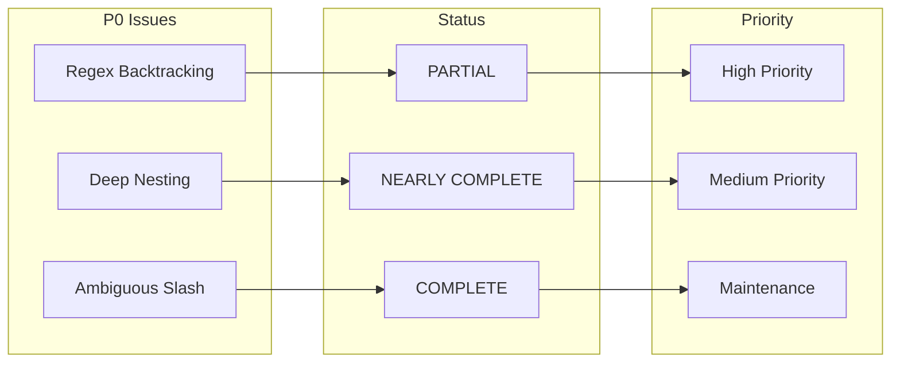
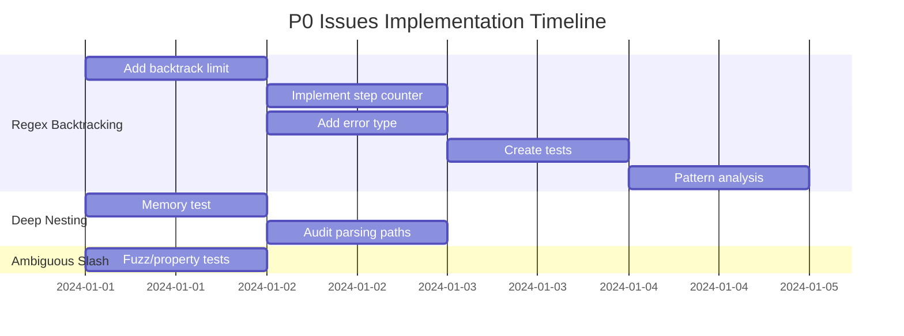

# P0 Critical Issues Resolution Plans

This directory contains resolution plans for the 3 P0 critical timeout/hang risk issues identified in the Perl LSP project.

## Overview



## Resolution Plans

| Issue | Status | Priority | Plan Document |
|-------|--------|----------|---------------|
| Ambiguous Slash Division vs Regex | ✅ COMPLETE | Low | [P0-ambiguous-slash-division-regex.md](./P0-ambiguous-slash-division-regex.md) |
| Deep Nesting Stack Overflow | ⚠️ NEARLY COMPLETE | Medium | [P0-deep-nesting-stack-overflow.md](./P0-deep-nesting-stack-overflow.md) |
| Catastrophic Regex Backtracking | ⚠️ PARTIAL | High | [P0-catastrophic-regex-backtracking.md](./P0-catastrophic-regex-backtracking.md) |

## Summary by Issue

### 1. Ambiguous Slash Division vs Regex

**Status**: ✅ COMPLETE

The mode-aware lexer fully implements slash disambiguation with comprehensive test coverage (21 test cases). No further implementation required.

**Remaining Work**: None for ADR coverage; optional fuzz/property testing could further strengthen regression protection.

### 2. Deep Nesting Stack Overflow

**Status**: ⚠️ NEARLY COMPLETE

The `MAX_RECURSION_DEPTH = 128` limit is implemented with RAII guard pattern. Most test coverage is in place.

**Remaining Work**:

- Add memory bounded usage test
- Audit all recursive parsing paths

### 3. Catastrophic Regex Backtracking

**Status**: ⚠️ PHASE 1 COMPLETE

Byte limits (64KB), nesting limits (128), and the lexer parse budget are in place, but critical gaps remain:

**Missing Protections**:

- No pattern analysis for pathological patterns
- No diagnostics for regex-engine catastrophic backtracking risk
- No timeout protection

**Priority**: This is the highest priority issue requiring immediate attention.

## Actionable Next Steps

### Immediate Actions (Required)

| # | Action | Issue | Effort |
|---|--------|-------|--------|
| 1 | Create `regex_analysis.rs` module | Regex Backtracking | Medium |
| 2 | Implement nested quantifier detection | Regex Backtracking | Medium |
| 3 | Add LSP diagnostics for risky patterns | Regex Backtracking | Medium |
| 4 | Add risk-analysis regression coverage | Regex Backtracking | Small |
| 5 | Add memory bounded usage test | Deep Nesting | Small |

### Short-term Actions (Recommended)

| # | Action | Issue | Effort |
|---|--------|-------|--------|
| 6 | Implement overlapping alternative detection | Regex Backtracking | Medium |
| 7 | Evaluate timeout protection as defense-in-depth | Regex Backtracking | Medium |
| 8 | Add telemetry for repeated parse-budget hits | Regex Backtracking | Medium |
| 9 | Audit all recursive parsing paths | Deep Nesting | Medium |
| 10 | Add fuzz/property tests for slash disambiguation | Ambiguous Slash | Small |

### Long-term Actions (Optional)

| # | Action | Issue | Effort |
|---|--------|-------|--------|
| 11 | Implement timeout protection | Regex Backtracking | Medium |
| 12 | Add configurable limits | Deep Nesting | Medium |
| 13 | Add overlapping alternative detection | Regex Backtracking | Medium |

## Implementation Order



## Verification Commands

```bash
# Test all P0 protections
cargo test -p perl-lexer --test lexer_slash_timeout_tests
cargo test -p perl-lexer --test lexer_catastrophic_regex_test
cargo test -p perl-parser --test hang_risk_deep_nesting_tests

# Run all hang risk tests
cargo test -p perl-lexer -- hang_risk
cargo test -p perl-parser -- hang_risk
```

## Related Documentation

- [Timeout/Hang Risk Issues](../corpus/gaps/timeout-hang-risks/)
- [Crate Architecture Guide](../../reference/CRATE_ARCHITECTURE_GUIDE.md)
- [Error Handling Strategy](../../adr/0012-error-handling-strategy.md)

## References

- [CWE-674: Uncontrolled Recursion](https://cwe.mitre.org/data/definitions/674.html)
- [CWE-1333: Inefficient Regular Expression Complexity](https://cwe.mitre.org/data/definitions/1333.html)
- [OWASP ReDoS](https://owasp.org/www-community/attacks/Regular_expression_Denial_of_Service_-_ReDoS)
